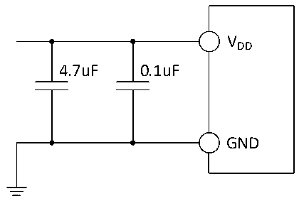

<!-- source-page: 34 -->

[← p.33](0033.md) · [index](../README.md) · [PDF p.34](https://ch32-riscv-ug.github.io/CH32X035/datasheet_zh/CH32X035DS0.PDF#page=34) · [p.35 →](0035.md)

<!-- header: CH32X035数据手册 https://wch.cn -->

图3-9 模拟电源及退耦电路参考  
 <!-- rendered from the PDF; verify at https://ch32-riscv-ug.github.io/CH32X035/datasheet_zh/CH32X035DS0.PDF#page=34 -->

🖼 Text parsed from the figure above

VDD  
4.7uF 0.1uF  
GND  

### 3.3.16 OPA特性

<!-- p34-table-001 (table-3-24@1) pages 34-35 -->
<table><caption>表3-24 OPA运放特性</caption><tr><th>符号</th><th>参数</th><th style="text-align:left">条件：V = 5VDD</th><th>最小值</th><th>典型值</th><th>最大值</th><th>单位</th></tr><tr><td style="text-align:left">VDD</td><td>供电电压</td><td>建议不低于2.5V</td><td>2</td><td>5</td><td>5.5</td><td>V</td></tr><tr><td style="text-align:left">VCM</td><td>共模输入电压</td><td></td><td>0</td><td></td><td style="text-align:left">VDD</td><td>V</td></tr><tr><td rowspan="3" style="text-align:left">VIOFFSET</td><td rowspan="3">输入失调电压</td><td style="text-align:left">共模输入V = 0.5VCM</td><td></td><td>±5</td><td>±13</td><td rowspan="3">mV</td></tr><tr><td style="text-align:left">共模输入V = V /2 CM DD</td><td></td><td>±3</td><td>±10</td></tr><tr><td style="text-align:left">共模输入V = V -0.5V CM DD</td><td></td><td>±5</td><td>±17</td></tr><tr><td style="text-align:left">ILOAD</td><td>驱动电流</td><td style="text-align:left">R = 5kΩLOAD</td><td></td><td></td><td>1</td><td>mA</td></tr><tr><td style="text-align:left">ILOAD_PGA</td><td>PGA模式驱动电流</td><td></td><td></td><td></td><td>400</td><td>uA</td></tr><tr><td style="text-align:left">IDDOPAMP</td><td>消耗电流</td><td>无负载，静态模式</td><td></td><td>210</td><td></td><td>uA</td></tr><tr><td>CMRR(1)</td><td>共模抑制比</td><td>@1kHz</td><td></td><td>110</td><td></td><td>dB</td></tr><tr><td>PSRR(1)</td><td>电源抑制比</td><td>@1kHz</td><td></td><td>71</td><td></td><td>dB</td></tr><tr><td>Av(1)</td><td>开环增益</td><td style="text-align:left">C = 5pFLOAD</td><td></td><td>110</td><td></td><td>dB</td></tr><tr><td style="text-align:left">G (1) BW</td><td>单位增益带宽</td><td style="text-align:left">C = 5pFLOAD</td><td></td><td>13</td><td></td><td>MHz</td></tr><tr><td style="text-align:left">P(1) M</td><td>相位裕度</td><td style="text-align:left">C = 5pFLOAD</td><td></td><td>88</td><td></td><td></td></tr><tr><td style="text-align:left">S(1) R</td><td>压摆率</td><td style="text-align:left">C = 5pFLOAD</td><td></td><td>5</td><td></td><td>V/us</td></tr><tr><td style="text-align:left">t (1) WAKUP</td><td>关闭到唤醒时间，0.1%</td><td style="text-align:left">输入V /2， DD C = 50pF，R = 5kΩ LOAD LOAD</td><td></td><td></td><td>1</td><td>us</td></tr><tr><td style="text-align:left">RLOAD</td><td>阻性负载</td><td></td><td>5</td><td></td><td></td><td>kΩ</td></tr><tr><td style="text-align:left">CLOAD</td><td>容性负载</td><td></td><td></td><td></td><td>50</td><td>pF</td></tr><tr><td rowspan="2" style="text-align:left">V (2) OHSAT</td><td rowspan="2">高饱和输出电压</td><td style="text-align:left">R = 5kΩLOAD</td><td style="text-align:left">V -300DD</td><td></td><td></td><td rowspan="2">mV</td></tr><tr><td style="text-align:left">R = 20kΩLOAD</td><td style="text-align:left">V -50DD</td><td></td><td></td></tr><tr><td rowspan="2" style="text-align:left">V (2) OLSAT</td><td rowspan="2">低饱和输出电压</td><td style="text-align:left">R = 5kΩLOAD</td><td></td><td></td><td>10</td><td rowspan="2">mV</td></tr><tr><td style="text-align:left">R = 20kΩLOAD</td><td></td><td></td><td>7</td></tr><tr><td rowspan="5" style="text-align:left">PGAGain(1)</td><td>NSEL=010b模式同相</td><td>Gain =16，PA1=GND</td><td>-3</td><td></td><td>3</td><td>%</td></tr><tr><td rowspan="4">内部同相PGA</td><td style="text-align:left">Gain = 4 V ＜ (V /7) INP DD</td><td>-1</td><td></td><td>1</td><td>%</td></tr><tr><td style="text-align:left">Gain = 8 V ＜ (V /15) INP DD</td><td>-1</td><td></td><td>1</td><td>%</td></tr><tr><td style="text-align:left">Gain = 16 V ＜ (V /31) INP DD</td><td>-1</td><td></td><td>1</td><td>%</td></tr><tr><td style="text-align:left">Gain = 32 V ＜ (V /63) INP DD</td><td>-1</td><td></td><td>1</td><td>%</td></tr><tr><td>Delta R</td><td>电阻绝对值变化</td><td></td><td>-15</td><td></td><td>15</td><td>%</td></tr><tr><td rowspan="2">EN(1)</td><td rowspan="2">等效输入噪声</td><td style="text-align:left">R = 5kΩ@1kHz LOAD</td><td></td><td>100</td><td></td><td rowspan="2" style="text-align:left">nV/ sqrt(Hz)</td></tr><tr><td style="text-align:left">R = 20kΩ@1KHz LOAD</td><td></td><td>60</td><td></td></tr></table>

<!-- image: p34-draw-image-00001 bbox=[502.8, 786.36, 522.24, 796.68] -->
<!-- footer: V2.2 32 -->
