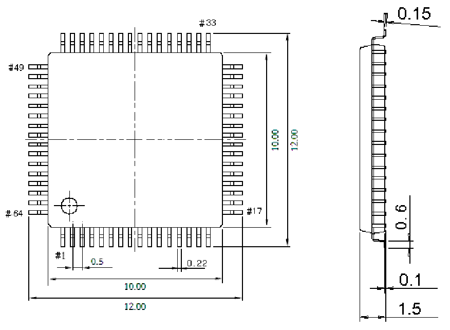
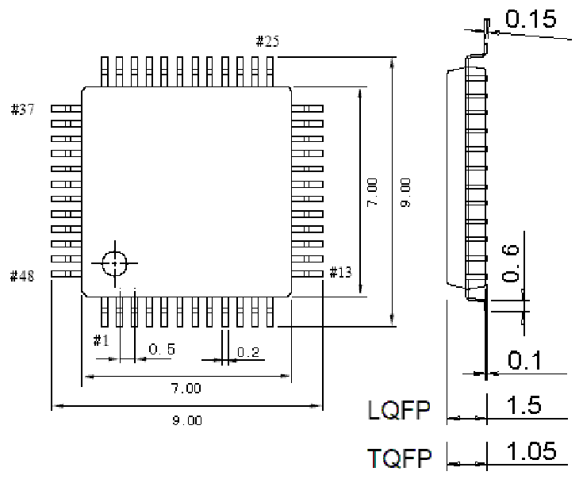

<!-- source-page: 37 -->

[← p.36](0036.md) · [index](../README.md) · [PDF p.37](https://ch32-riscv-ug.github.io/CH32X035/datasheet_zh/CH32X035DS0.PDF#page=37) · [p.38 →](0038.md)

<!-- header: CH32X035数据手册 https://wch.cn -->
说明：尺寸标注的单位是 mm（毫米），引脚中心间距总是标称值，没有误差，除此之外的尺寸误差不  
大于±0.2mm或者±10%两者中的较大值。  

## 4.1 LQFP64M封装

 <!-- p37-draw-image-00002 rendered from the PDF -->

## 4.2 LQFP48封装

 <!-- p37-draw-image-00003 rendered from the PDF -->

<!-- image: p37-draw-image-00001 bbox=[502.8, 779.28, 522.24, 789.6] -->
<!-- footer: V2.2 35 -->
