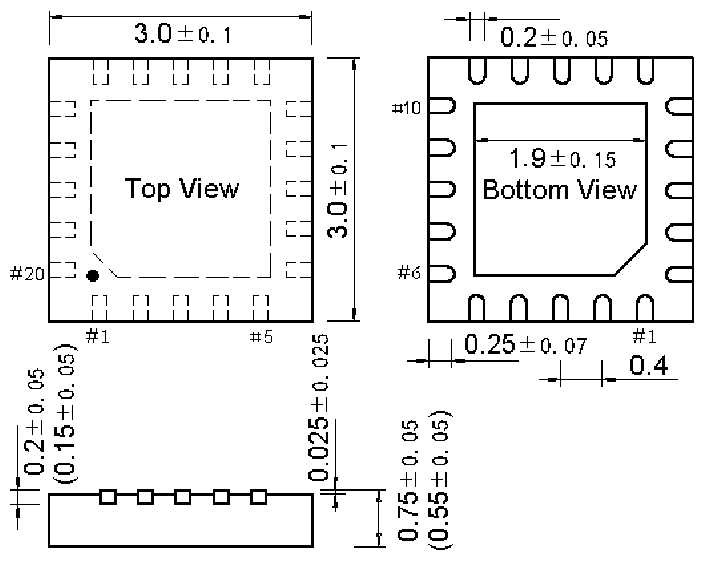
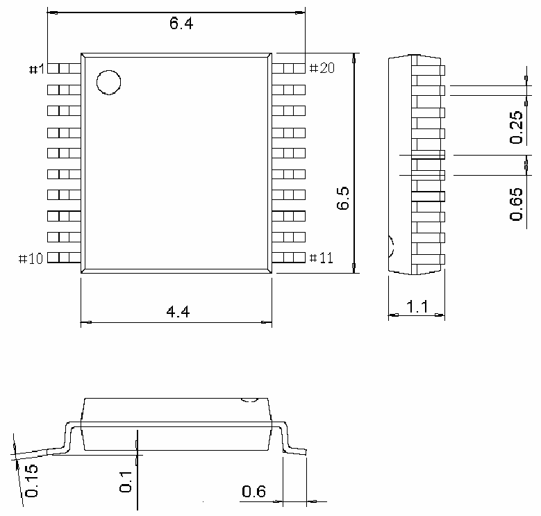

<!-- source-page: 39 -->

[← p.38](0038.md) · [index](../README.md) · [PDF p.39](https://ch32-riscv-ug.github.io/CH32X035/datasheet_zh/CH32X035DS0.PDF#page=39) · [p.40 →](0040.md)

<!-- header: CH32X035数据手册 https://wch.cn -->

## 4.5 QFN20封装

 <!-- p39-draw-image-00002 rendered from the PDF -->

## 4.6 TSSOP20封装

 <!-- p39-draw-image-00003 rendered from the PDF -->

<!-- image: p39-draw-image-00001 bbox=[502.8, 779.28, 522.24, 789.6] -->
<!-- footer: V2.2 37 -->
