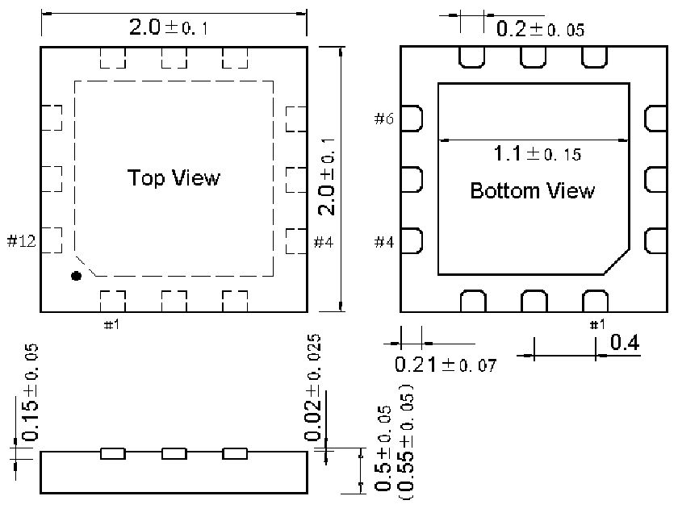

<!-- source-page: 40 -->

[← p.39](0039.md) · [index](../README.md) · [PDF p.40](https://ch32-riscv-ug.github.io/CH32X035/datasheet_zh/CH32X035DS0.PDF#page=40) · [p.41 →](0041.md)

<!-- header: CH32X035数据手册 https://wch.cn -->

## 4.7 QFN12封装

 <!-- p40-draw-image-00002 rendered from the PDF -->

<!-- image: p40-draw-image-00001 bbox=[502.8, 779.28, 522.24, 789.6] -->
<!-- footer: V2.2 38 -->
