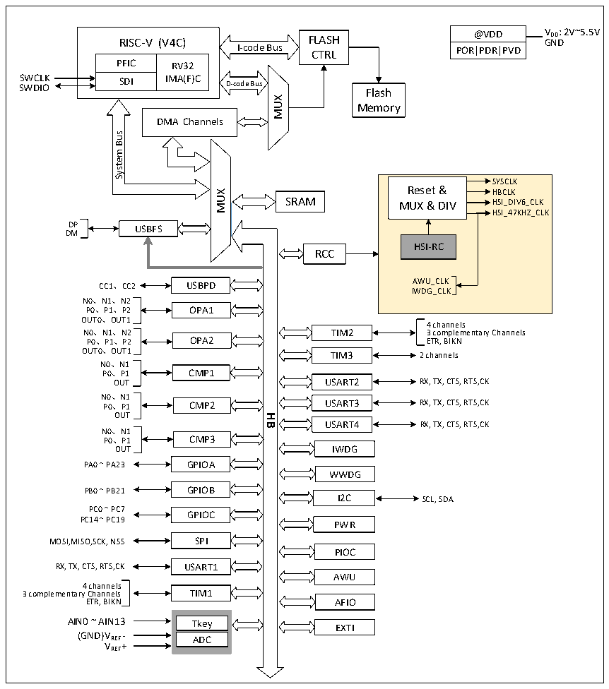

<!-- source-page: 3 -->

[← p.2](0002.md) · [index](../README.md) · [PDF p.3](https://ch32-riscv-ug.github.io/CH32X035/datasheet_en/CH32X035RM.PDF#page=3) · [p.4 →](0004.md)

<!-- header: CH32X035 Reference Manual https://wch-ic.com -->

# Chapter 1 Memory and Bus Architecture

## 1.1 Bus Architecture

The microcontroller is designed on the basis of the RISC-V instruction set and its architecture incorporates  
QingKe microprocessor core, arbitration unit, DMA module, SRAM storage and other components interacting via  
multiple sets of buses. Its system block diagram is shown in Figure 1-1.  

Figure 1-1 CH32X035 system block diagram  
 <!-- rendered from the PDF; verify at https://ch32-riscv-ug.github.io/CH32X035/datasheet_en/CH32X035RM.PDF#page=3 -->

🖼 Text parsed from the figure above

@VDD V DD : 2V~5.5V GND  
RISC-V (V4C) FLASH  
RISC-V (V4C)  PFIC  RV32IMA(F)C  SDI  
I-code Bus CTRL  
POR|PDR|PVD  
SWCLK SWDIO  
Flash  
MUX  
Memory  
DMA Channels  
Bus  
<!-- image: p3-draw-image-00002 inside the figure -->
System  
SYSCLK  
Reset &amp; HBCLK  
MUX  
SRAM  
MUX &amp; DIV HSI_DIV6_CLK  
HSI_47KHZ_CLK  
DP  
USBFS  
DM  
HSI-RC  
RCC  
CC1、CC2 AWU_CLK  
USBPD  
IWDG_CLK  
N0、N1、N2  
P0、P1、P2 OPA1  
OUT0、OUT1  
4 channels  
N0、N1、N2  
TIM2 3 complementary Channels  
P0、P1、P2 OPA2  
ETR, BIKN  
OUT0、OUT1  
TIM3 2 channels  
N0、N1  
P0、P1 CMP1  
USART2 RX, TX, CTS, RTS,CK  
OUT  
N0、N1  
USART3 RX, TX, CTS, RTS,CK  
P0、P1 CMP2  
OUT  
<strong>HB</strong>  
USART4  
RX, TX, CTS, RTS,CK  
N0、N1  
P0、P1 CMP3  
IWDG  
OUT  
PA0 ~ PA23 GPIOA  
WWDG  
GPIOB  
PB0 ~ PB21  
I2C SCL, SDA  
PC0 ~ PC7  
GPIOC  
PC14 ~ PC19  
PWR  
MOSI,MISO,SCK, NSS SPI  
PIOC  
RX, TX, CTS, RTS,CK USART1  
AWU  
4 channels  
3 complementary Channels TIM1  
AFIO  
ETR, BIKN  
AIN0 ~ AIN13 Tkey  
EXTI  
(GND)V REF - ADC  
VREF+  

The system is equipped with: General-purpose DMA controller to reduce the CPU burden and improve efficiency;  
clock tree hierarchy management to reduce the total power consumption of peripherals, as well as data protection  
mechanisms, clock security system protection mechanisms and other measures to increase system stability.  
● The instruction bus (I-Code) connects the core to the FLASH instruction interface and prefetching is done on  
this bus.  
<!-- image: p3-draw-image-00001 bbox=[506.76, 783.48, 526.2, 793.8] -->
<!-- footer: V1.9 1 -->
