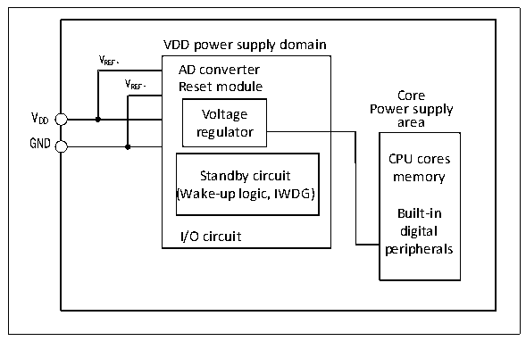

<!-- source-page: 7 -->

[← p.6](0006.md) · [index](../README.md) · [PDF p.7](https://ch32-riscv-ug.github.io/CH32X035/datasheet_en/CH32X035RM.PDF#page=7) · [p.8 →](0008.md)

<!-- header: CH32X035 Reference Manual https://wch-ic.com -->

# Chapter 2 Power Control (PWR)

## 2.1 Overview

The system operating voltage VDD ranges from 2 to 5.5V and the built-in voltage regulator provides the low  
voltage power required by the core.  
The VDD and GND pins are dedicated to powering the analogue related circuits in the system, including the ADC  
etc. VREF+ and VREF- are used as reference points for some analogue circuits and are equal to VDD and GND inside  
the chip.  

Figure 2-1 Block diagram of power supply structure  
 <!-- rendered from the PDF; verify at https://ch32-riscv-ug.github.io/CH32X035/datasheet_en/CH32X035RM.PDF#page=7 -->

🖼 Text parsed from the figure above

VDD power supply domain  
VREF+  
AD converter  
VREF-  
VREF- Reset module  
Core  
V Voltage Power supply  
DD area  
regulator  
GND  
CPU cores  
Standby circuit memory  
(Wake-up logic, IWDG)  
Built-in  
I/O circuit digital  
peripherals  

## 2.2 Power Management

### 2.2.1 Power-on Reset and Power-down Reset

The system integrated a power-on reset POR and a power-down reset PDR circuit. When the chip supply voltage  
VDD falls below the corresponding threshold voltage, the system is reset by the relevant circuit, and no additional  
external reset circuit is required. Please refer to the corresponding datasheet for the parameters of the power-on  
threshold voltage VPOR and the power-down threshold voltage VPDR.  
<!-- image: p7-draw-image-00001 bbox=[506.76, 783.48, 526.2, 793.8] -->
<!-- footer: V1.9 5 -->
