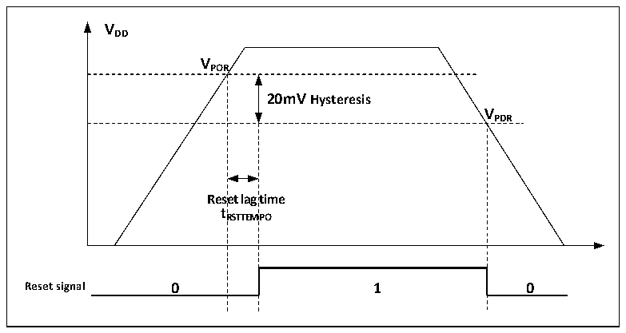
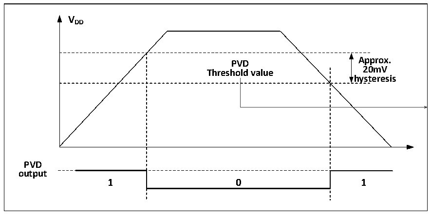

<!-- source-page: 8 -->

[← p.7](0007.md) · [index](../README.md) · [PDF p.8](https://ch32-riscv-ug.github.io/CH32X035/datasheet_en/CH32X035RM.PDF#page=8) · [p.9 →](0009.md)

<!-- header: CH32X035 Reference Manual https://wch-ic.com -->

Figure 2-2 Schematic diagram of the operation of POR and PDR  
 <!-- rendered from the PDF; verify at https://ch32-riscv-ug.github.io/CH32X035/datasheet_en/CH32X035RM.PDF#page=8 -->

🖼 Text parsed from the figure above

<strong>VDD</strong>  
<strong>VPOR</strong>  
20mV Hysteresis  Rese t R  et lag RSTTEM  time MPO  V  
<strong>VPDR</strong>  
<strong>tRSTTEMPO</strong>  
<strong>Reset signal 0 1 0</strong>  

### 2.2.2 Programmable Voltage Detector

The programmable voltage detector, PVD, is mainly used to monitor the change of the main power supply of the  
system and compare it with the threshold voltage set by PLS[1:0] of the power control register PWR_CTLR, and  
with the external interrupt register (EXTI) setting, it can generate relevant interrupts to notify the system in time  
for pre-power down operations such as data saving.  
The specific configuration is as follows.  
1) Set the PLS[1:0] field of the PWR_CTLR register and select the voltage threshold to be monitored.  
2) Optional interrupt handling. the PVD function is internally connected to the rising/falling edge trigger setting of  
line 26 of the EXTI module, turning on this interrupt (Configuring EXTI) will generate a PVD interrupt when  
VDD drops below the PVD threshold or rises above the PVD threshold.  
3) Read the PVD0 bit of the PWR_CSR status register can obtain the current system mains power in relation to  
the PLS[1:0] setting threshold and perform the corresponding soft processing.  

Figure 2-3 Schematic diagram of PVD operation  
 <!-- rendered from the PDF; verify at https://ch32-riscv-ug.github.io/CH32X035/datasheet_en/CH32X035RM.PDF#page=8 -->

🖼 Text parsed from the figure above

<strong>VDD</strong>  
PVD Threshold value  0  
<strong>Approx.</strong>  
<strong>20mV</strong>  
<strong>hysteresis</strong>  
<strong>PVD</strong>  
<strong>output</strong>  

<!-- image: p8-draw-image-00001 bbox=[506.76, 783.48, 526.2, 793.8] -->
<!-- footer: V1.9 6 -->
