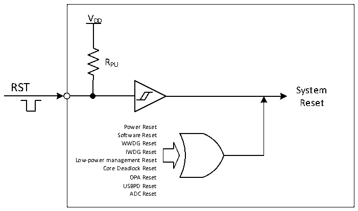

<!-- source-page: 14 -->

[← p.13](0013.md) · [index](../README.md) · [PDF p.14](https://ch32-riscv-ug.github.io/CH32X035/datasheet_en/CH32X035RM.PDF#page=14) · [p.15 →](0015.md)

<!-- header: CH32X035 Reference Manual https://wch-ic.com -->
reset instead of entering shutdown mode after the process of entering shutdown mode has been executed.  
Core Deadlock Reset: With PFIC_SCTLR register RSTEN at 0, a deadlock reset is generated when the core  
addresses an exception or enters an NMI interrupt, note: A deadlock reset cannot be generated in tuned mode.  
OPA reset: When OPA reset enable is on, an OPA reset will be generated when the op-amp output goes high.  
USBPD reset: When PD_RST_EN is 1, CH32X035 supports the reset generated by USB PD signal frame Hard  
Reset; if IE_RX_RESET is also 1, it also supports the reset generated by signal frame Cable Reset. the reset flag  
generated by USB PD is the same as software reset.  
ADC Reset: If the ADC watchdog reset enable is on, an ADC reset is generated when the ADC data is greater than  
the watchdog high threshold or less than the watchdog low threshold.  

Figure 3-1 System reset structure  
 <!-- rendered from the PDF; verify at https://ch32-riscv-ug.github.io/CH32X035/datasheet_en/CH32X035RM.PDF#page=14 -->

🖼 Text parsed from the figure above

VDD  
RPU  
RST  
System  
Reset  
Power Reset  
Software Reset  
WWDG Reset  
IWDG Reset  
Low-power management Reset  
Core Deadlock Reset  
OPA Reset  
USBPD Reset  
ADC Reset  

<!-- image: p14-draw-image-00001 bbox=[511.32, 783.48, 530.76, 793.8] -->
<!-- footer: V1.9 12 -->
