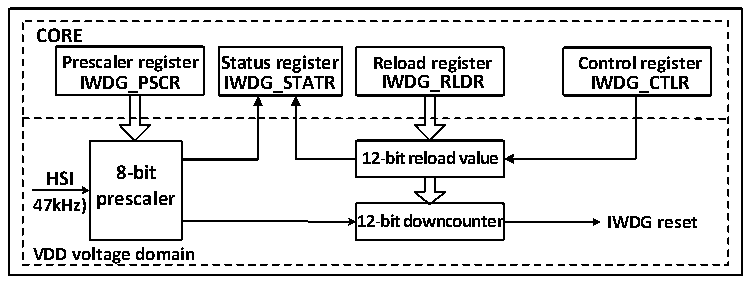

<!-- source-page: 25 -->

[← p.24](0024.md) · [index](../README.md) · [PDF p.25](https://ch32-riscv-ug.github.io/CH32X035/datasheet_en/CH32X035RM.PDF#page=25) · [p.26 →](0026.md)

<!-- header: CH32X035 Reference Manual https://wch-ic.com -->

# Chapter 5 Independent Watchdog (IWDG)

The system is equipped with an independent watchdog (IWDG) to detect logic errors and software faults caused  
by external environmental disturbances. the IWDG clock source is derived from the LSI and can run  
independently of the main program, making it suitable for applications requiring low accuracy.  

## 5.1 Main Features

● 12-bit self-subtracting counter  
● Clock source HSI divided by 1024 (47KHz), can run in low-power mode  
● Reset condition: Counter value is reduced to 0  

## 5.2 Function Description

### 5.2.1 Principle and Application

The independent watchdog is clocked from the HSI clock and its function remains functional during shutdown  
and Standby modes. When the watchdog counter self-decreases to 0, a system Reset will be generated, so the  
timeout is (Reload value + 1) clock.  

Figure 5-1 Block diagram of the structure of the independent watchdog  
 <!-- rendered from the PDF; verify at https://ch32-riscv-ug.github.io/CH32X035/datasheet_en/CH32X035RM.PDF#page=25 -->

🖼 Text parsed from the figure above

<strong>CORE</strong>  
<strong>Prescaler register Status register Reload register Control register</strong>  
<strong>IWDG_PSCR IWDG_STATR IWDG_RLDR IWDG_CTLR</strong>  
<strong>12-bit reload value</strong>  
<strong>8-bit</strong>  
<strong>HSI</strong>  
<strong>prescaler</strong>  
<strong>47kHz)</strong>  
<strong>12-bit downcounter IWDG reset</strong>  
<strong>VDD voltage domain</strong>  

● Enable independent watchdog  
After a system reset, the watchdog is off and writing 0xCCCC to the IWDG_CTLR register turns the watchdog on,  
after which it cannot be turned off again unless a reset occurs.  
If the hardware independent watchdog enable bit (IWDG_SW) is turned on at the user-selected word, IWDG will  
be fixed on after a microcontroller reset.  
● Watchdog configuration  
The watchdog is internally a 12-bit counter that runs decreasingly. When the counter value decreases to 0, a  
system Reset will occur. To turn on the IWDG function, the following actions need to be performed.  
1) Counting time base: IWDG clock source HIS divided by 1024, set the HSI crossover value clock as the  
counting time base of IWDG through the IWDG_PSCR register. The operation method first writes 0x5555 to  
the IWDG_CTLR register, and then modifies the crossover value in the IWDG_PSCR register. the PVU bit  
in the IWDG_STATR register indicates the update status of the crossover value, and the crossover value can  
be modified and read out only when the update is completed.  
<!-- image: p25-draw-image-00001 bbox=[511.32, 783.48, 530.76, 793.8] -->
<!-- footer: V1.9 23 -->
