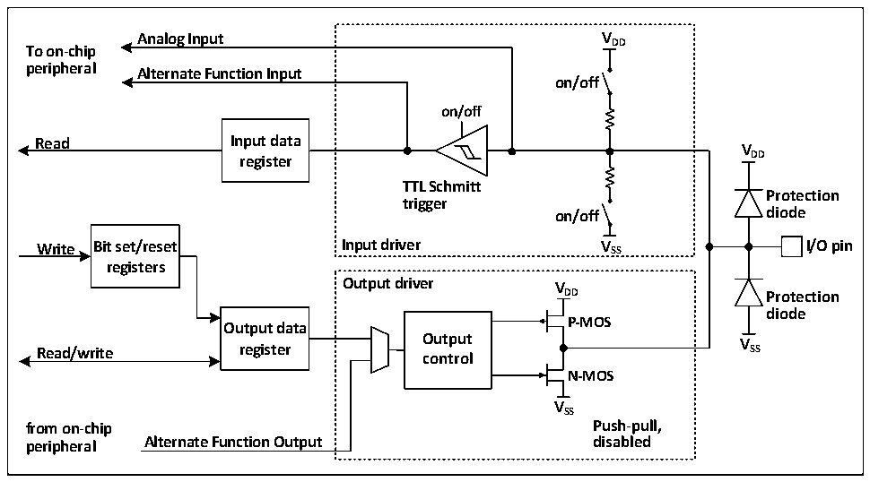

<!-- source-page: 60 -->

[← p.59](0059.md) · [index](../README.md) · [PDF p.60](https://ch32-riscv-ug.github.io/CH32X035/datasheet_en/CH32X035RM.PDF#page=60) · [p.61 →](0061.md)

<!-- header: CH32X035 Reference Manual https://wch-ic.com -->

# Chapter 8 GPIO and Alternate Function (GPIO/AFIO)

The GPIO ports can be configured into various input or output modes, with built-in pull-up resistors that can be  
turned off, and some GPIOs have built-in pull-down resistors that can be turned off, and can be configured into  
push-pull function. the GPIO ports can also be alternate into other functions. PA0-PA7, PB0-PB1 and PC0-PC3  
support ADC analogue signal input channels 0 to 13. All GPIO pins support controlled pull-up, only PA0-PA15  
and PC16-PC17 support controlled pull-down, the remaining pins do not support pull-down. PC14-PC17 support  
multiple pull-up modes, which are set by the dedicated control registers corresponding to the PD and USB pins  
respectively.  

## 8.1 Main Features

Each pin of the port can be configured to one of the following multiple modes.  
● Floating input ● Analog input  
● Pull-up input ● Push-pull output  
● Pull-down input (partial IO) ● Inputs and outputs of alternate functions  
Many pins have alternate capabilities, and many other peripherals map their output and input channels to these  
pins. The specific usage of these alternate pins needs to be referred to the individual peripherals, and the content  
of whether these pins are alternate and remapped is explained in this chapter.  

## 8.2 Function Description

### 8.2.1 Overview

Figure 8-1 GPIO module basic structure block diagram  
 <!-- rendered from the PDF; verify at https://ch32-riscv-ug.github.io/CH32X035/datasheet_en/CH32X035RM.PDF#page=60 -->

🖼 Text parsed from the figure above

<strong>Analog Input V DD</strong>  
<strong>To on-chip</strong>  
<strong>peripheral Alternate Function Input</strong>  
<strong>on/off</strong>  
<strong>on/off</strong>  
<strong>Read Input data</strong>  
<strong>V</strong>  
<strong>register DD</strong>  
<strong>TTL Schmitt</strong>  
<strong>Protection</strong>  
<strong>trigger</strong>  
<strong>on/off diode</strong>  
<strong>Write Bit set/reset Input driver V SS I/O pin</strong>  
<strong>registers</strong>  
<strong>Output driver V</strong>  
<strong>DD Protection</strong>  
<strong>diode</strong>  
<strong>Output data P-MOS</strong>  
<strong>Read/write register O co u n t t p r u o t l V SS</strong>  
<strong>N-MOS</strong>  
<strong>VSS</strong>  
<strong>from on-chip Push-pull,</strong>  
<strong>peripheral Alternate Function Output disabled</strong>  

As shown in Figure 8-1 IO port structure, each pin has two protection diodes inside the chip, and the IO port can  
be internally divided into input and output driver modules. The input driver has a pull-up resistor and a pull-down  
<!-- image: p60-draw-image-00001 bbox=[511.32, 783.48, 530.76, 793.8] -->
<!-- footer: V1.9 58 -->
