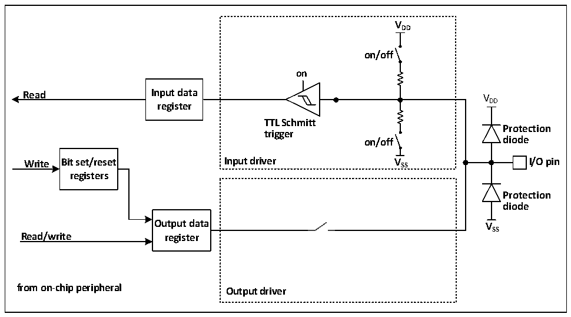
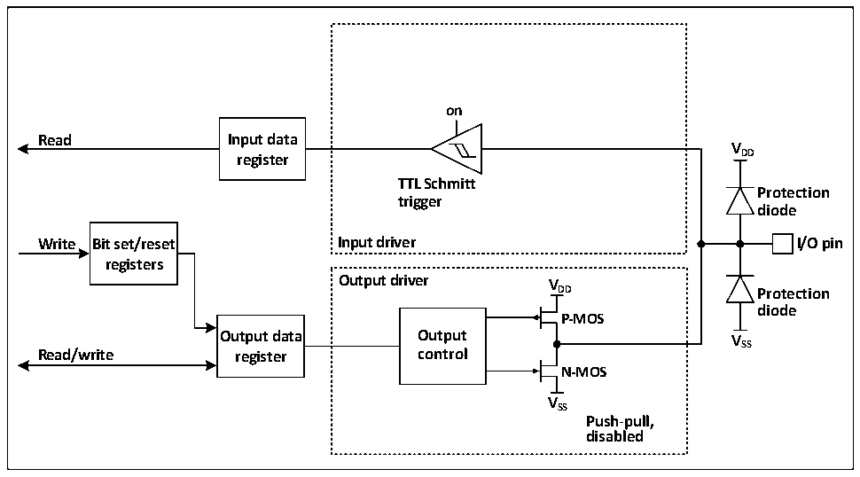

<!-- source-page: 62 -->

[← p.61](0061.md) · [index](../README.md) · [PDF p.62](https://ch32-riscv-ug.github.io/CH32X035/datasheet_en/CH32X035RM.PDF#page=62) · [p.63 →](0063.md)

<!-- header: CH32X035 Reference Manual https://wch-ic.com -->

### 8.2.6 Input Configuration

Figure 8-2 GPIO module input configuration structure block diagram  
 <!-- rendered from the PDF; verify at https://ch32-riscv-ug.github.io/CH32X035/datasheet_en/CH32X035RM.PDF#page=62 -->

🖼 Text parsed from the figure above

<strong>VDD</strong>  
<strong>on/off</strong>  
<strong>on</strong>  
<strong>Read Input data V</strong>  
DD  
<strong>register</strong>  
<strong>TTL Schmitt</strong>  
<strong>Protection</strong>  
<strong>trigger</strong>  
<strong>on/off diode</strong>  
<strong>Write Bit set/reset Input driver V SS I/O pin</strong>  
<strong>registers</strong>  
<strong>Protection</strong>  
<strong>diode</strong>  
<strong>Output data V</strong>  
<strong>SS</strong>  
<strong>Read/write register</strong>  
<strong>from on-chip peripheral Output driver</strong>  

When the IO port is configured in input mode, the output driver is disconnected, the input pull-up and pull-down  
are selectable, and no alternate functions or analogue inputs are connected. The data on each IO port is sampled at  
each HB clock into the input data register and the level status of the corresponding pin is obtained by reading the  
corresponding bit in the input data register.  

### 8.2.7 Output Configuration

Figure 8-3 GPIO module output configuration structure block diagram  
 <!-- rendered from the PDF; verify at https://ch32-riscv-ug.github.io/CH32X035/datasheet_en/CH32X035RM.PDF#page=62 -->

🖼 Text parsed from the figure above

<strong>on</strong>  
<strong>Read Input data</strong>  
<strong>V</strong>  
<strong>register DD</strong>  
<strong>TTL Schmitt</strong>  
<strong>Protection</strong>  
<strong>trigger</strong>  
<strong>diode</strong>  
<strong>Write Bit set/reset Input driver I/O pin</strong>  
<strong>registers</strong>  
<strong>Output driver V</strong>  
<strong>DD Protection</strong>  
<strong>diode</strong>  
<strong>P-MOS</strong>  
<strong>Output data Output V</strong>  
<strong>SS</strong>  
<strong>Read/write register control</strong>  
<strong>N-MOS</strong>  
<strong>VSS</strong>  
<strong>Push-pull,</strong>  
<strong>disabled</strong>  

<!-- image: p62-draw-image-00001 bbox=[511.32, 783.48, 530.76, 793.8] -->
<!-- footer: V1.9 61 -->
