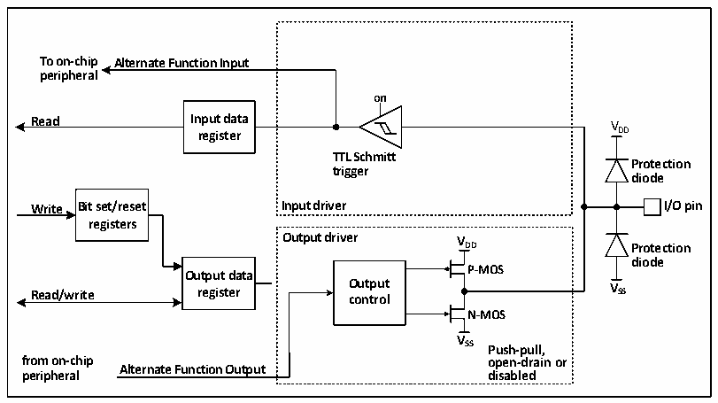

<!-- source-page: 63 -->

[← p.62](0062.md) · [index](../README.md) · [PDF p.63](https://ch32-riscv-ug.github.io/CH32X035/datasheet_en/CH32X035RM.PDF#page=63) · [p.64 →](0064.md)

<!-- header: CH32X035 Reference Manual https://wch-ic.com -->
When the IO port is configured in output mode, the output driver is configured in push-pull mode and does not  
use the multiplexing function. The input driver&#x27;s pull-up and pull-down resistors are disabled, the TTL Schmitt  
trigger is activated and the levels appearing on the IO pins will be sampled into the input data registers at each HB  
clock, so reading the input data registers will give the IO status and access to the output data registers will give the  
last written value.  

### 8.2.8 Alternate Function Configuration

Figure 8-4 The structure of GPIO module when it is alternate by other peripherals  
 <!-- rendered from the PDF; verify at https://ch32-riscv-ug.github.io/CH32X035/datasheet_en/CH32X035RM.PDF#page=63 -->

🖼 Text parsed from the figure above

<strong>To on-chip Alternate Function Input</strong>  
<strong>peripheral</strong>  
<strong>on</strong>  
<strong>Read Input data V</strong>  
<strong>register DD</strong>  
<strong>TTL Schmitt</strong>  
<strong>Protection</strong>  
<strong>trigger</strong>  
<strong>diode</strong>  
<strong>Write Bit set/reset Input driver I/O pin</strong>  
<strong>registers</strong>  
<strong>Output driver V</strong>  
<strong>DD Protection</strong>  
<strong>diode</strong>  
<strong>Output data P-MOS</strong>  
<strong>Read/write register O co u n t t p r u o t l V SS</strong>  
<strong>N-MOS</strong>  
<strong>V</strong>  
<strong>SS Push-pull,</strong>  
<strong>from on-chip open-drain or</strong>  
<strong>Alternate Function Output</strong>  
<strong>peripheral disabled</strong>  

When alternate is enabled, the output drivers are enabled, configured in push-pull mode, or automatically  
configured in open-drain mode if used for I2C, the Schmitt trigger is turned on, the input and output lines of the  
alternate function are connected, but the output data registers are disconnected, the levels present on the IO pins  
will be sampled into the input data registers at each HB clock, and reading the input data registers will give the  
current status of the IO port; in push-pull mode, reading the output data registers will give the last written value.  
<!-- image: p63-draw-image-00001 bbox=[511.32, 783.48, 530.76, 793.8] -->
<!-- footer: V1.9 62 -->
