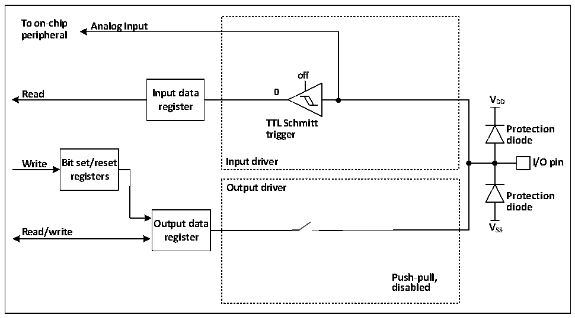

<!-- source-page: 64 -->

[← p.63](0063.md) · [index](../README.md) · [PDF p.64](https://ch32-riscv-ug.github.io/CH32X035/datasheet_en/CH32X035RM.PDF#page=64) · [p.65 →](0065.md)

<!-- header: CH32X035 Reference Manual https://wch-ic.com -->

### 8.2.9 Analog Input Configuration

Figure 8-5 The configuration structure when the GPIO module is used as an analog input  
 <!-- rendered from the PDF; verify at https://ch32-riscv-ug.github.io/CH32X035/datasheet_en/CH32X035RM.PDF#page=64 -->

🖼 Text parsed from the figure above

<strong>To on-chip Analog Input</strong>  
<strong>peripheral</strong>  
<strong>off</strong>  
<strong>Read Input data 0</strong>  
<strong>V</strong>  
<strong>register DD</strong>  
<strong>TTL Schmitt</strong>  
<strong>Protection</strong>  
<strong>trigger</strong>  
<strong>diode</strong>  
<strong>Write Bit set/reset Input driver I/O pin</strong>  
<strong>registers</strong>  
<strong>Output driver</strong>  
<strong>Protection</strong>  
<strong>diode</strong>  
<strong>Output data V</strong>  
<strong>Read/write SS</strong>  
<strong>register</strong>  
<strong>Push-pull,</strong>  
<strong>disabled</strong>  

When the analog input is enabled, the output buffer is disconnected, the input of the Schmitt trigger in the input  
driver is disabled to prevent the generation of consumption on the I/O port, the pull-up and pull-down resistors are  
disabled, and the read input data register will always be 0.  

### 8.2.10 GPIO Settings for Peripherals

The following table recommends the corresponding GPIO port configuration for each peripheral pin.  

<!-- p64-table-001 (table-8-1@1) -->
<table><caption>Table 8-1 Advanced-control timer (TIM1/2)</caption><tr><th>TIM1/2</th><th>Configuration</th><th>GPIO configuration</th></tr><tr><td rowspan="2">TIM1/2_CHx</td><td>Input capture channel x</td><td>Floating input</td></tr><tr><td>Output compare channel x</td><td>Push-pull alternate output</td></tr><tr><td>TIM1/2_CHxN</td><td>Complementary output channels x</td><td>Push-pull alternate output</td></tr><tr><td>TIM1/2_BKIN</td><td>Brake input</td><td>Floating input</td></tr><tr><td>TIM1/2_ETR</td><td>Externally triggered clock input</td><td>Floating input</td></tr></table>

<!-- p64-table-002 (table-8-2@1) -->
<table><caption>Table 8-2 General-purpose timer (TIM3)</caption><tr><th>TIM3 pin</th><th>Configuration</th><th>GPIO configuration</th></tr><tr><td rowspan="2">TIM3_CHx</td><td>Input capture channel x</td><td>Floating input</td></tr><tr><td>Output comparison channel x</td><td>Push-pull alternate output</td></tr><tr><td>TIM3_ETR</td><td>Externally triggered clock input</td><td>Floating input</td></tr></table>

<!-- p64-table-003 (table-8-3@1) pages 64-65 -->
<table><caption>Table 8-3 Universal synchronous asynchronous serial transceiver (USART)</caption><tr><th>USART pin</th><th>Configuration</th><th>GPIO configuration</th></tr><tr><td rowspan="2">USARTx_TX</td><td>Full-duplex mode</td><td>Push-pull alternate output</td></tr><tr><td>Half-duplex mode</td><td style="text-align:left">Push-pull alternate output (External plus pull)</td></tr><tr><td rowspan="2">USARTx_RX</td><td>Full-duplex mode</td><td>Floating input or pull-up input</td></tr><tr><td>Half-duplex synchronous mode</td><td>Not used</td></tr><tr><td>USARTx_CK</td><td>Synchronous mode</td><td>Push-pull alternate output</td></tr><tr><td>USARTx_RTS</td><td>Hardware flow control</td><td>Push-pull alternate output</td></tr><tr><td>USARTx_CTS</td><td>Hardware flow control</td><td>Floating input or pull-up input</td></tr></table>

<!-- image: p64-draw-image-00001 bbox=[511.32, 783.48, 530.76, 793.8] -->
<!-- footer: V1.9 63 -->
