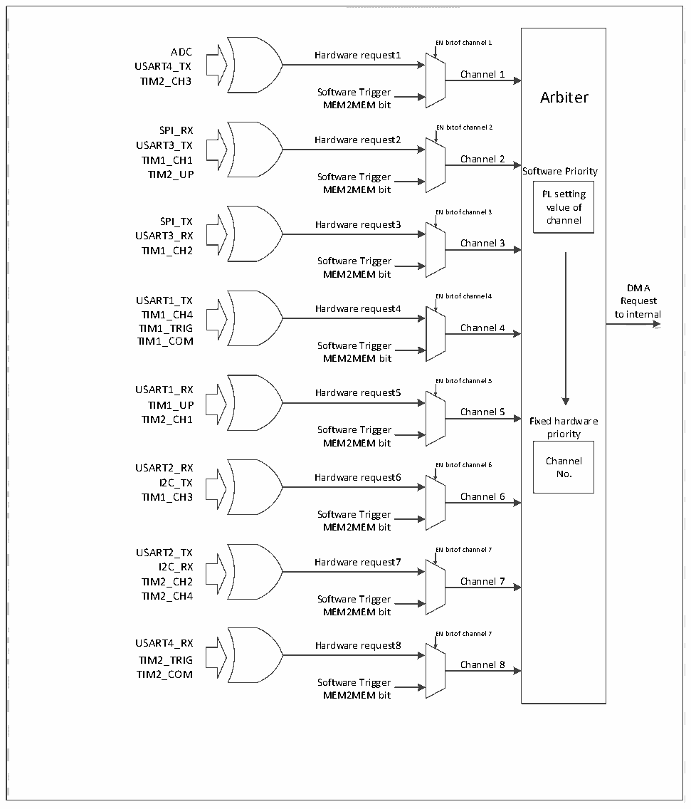

<!-- source-page: 82 -->

[← p.81](0081.md) · [index](../README.md) · [PDF p.82](https://ch32-riscv-ug.github.io/CH32X035/datasheet_en/CH32X035RM.PDF#page=82) · [p.83 →](0083.md)

<!-- header: CH32X035 Reference Manual https://wch-ic.com -->

### 9.2.3 DMA Request Mapping

Figure 9-1 DMA request image  
 <!-- rendered from the PDF; verify at https://ch32-riscv-ug.github.io/CH32X035/datasheet_en/CH32X035RM.PDF#page=82 -->

🖼 Text parsed from the figure above

<!-- image: p82-draw-image-00017 inside the figure -->
<!-- image: p82-draw-image-00016 inside the figure -->
EN bit of channel 1  
<!-- image: p82-draw-image-00018 inside the figure -->
<!-- image: p82-draw-image-00002 inside the figure -->
ADC Hardware request1  
<!-- image: p82-draw-image-00009 inside the figure -->
USART4_TX  
Channel 1  
TIM2_CH3  
<!-- image: p82-draw-image-00019 inside the figure -->
Software Trigger Arbiter  
MEM2MEM bit  
<!-- image: p82-draw-image-00020 inside the figure -->
SPI_RX EN bit of channel 2  
<!-- image: p82-draw-image-00003 inside the figure -->
Hardware request2  
<!-- image: p82-draw-image-00010 inside the figure -->
USART3_TX  
<!-- image: p82-draw-image-00021 inside the figure -->
TIM1_CH1 Channel 2  
TIM2_UP Software Trigger Software Priority  
MEM2MEM bit PL setting  
<!-- image: p82-draw-image-00022 inside the figure -->
value of  
EN bit of channel 3  
<!-- image: p82-draw-image-00004 inside the figure -->
SPI_TX Hardware request3 channel  
<!-- image: p82-draw-image-00011 inside the figure -->
<!-- image: p82-draw-image-00023 inside the figure -->
USART3_RX  
Channel 3  
TIM1_CH2  
Software Trigger  
<!-- image: p82-draw-image-00024 inside the figure -->
MEM2MEM bit  
DMA  
USART1_TX EN bit of channel 4 Request  
<!-- image: p82-draw-image-00025 inside the figure -->
<!-- image: p82-draw-image-00005 inside the figure -->
Hardware request4  
<!-- image: p82-draw-image-00012 inside the figure -->
TIM1_CH4 to internal  
<!-- image: p82-draw-image-00041 inside the figure -->
TIM1_TRIG Channel 4  
<!-- image: p82-draw-image-00026 inside the figure -->
TIM1_COM  
Software Trigger  
MEM2MEM bit  
<!-- image: p82-draw-image-00027 inside the figure -->
EN bit of channel 5  
<!-- image: p82-draw-image-00006 inside the figure -->
USART1_RX Hardware request5  
<!-- image: p82-draw-image-00013 inside the figure -->
TIM1_UP  
Channel 5  
<!-- image: p82-draw-image-00028 inside the figure -->
TIM2_CH1 Fixed hardware  
Software Trigger priority  
MEM2MEM bit  
<!-- image: p82-draw-image-00029 inside the figure -->
Channel  
USART2_RX EN bit of channel 6  
<!-- image: p82-draw-image-00007 inside the figure -->
Hardware request6 No.  
<!-- image: p82-draw-image-00014 inside the figure -->
I2C_TX  
<!-- image: p82-draw-image-00030 inside the figure -->
TIM1_CH3 Channel 6  
Software Trigger  
<!-- image: p82-draw-image-00031 inside the figure -->
MEM2MEM bit  
USART2_TX EN bit of channel 7  
<!-- image: p82-draw-image-00008 inside the figure -->
<!-- image: p82-draw-image-00032 inside the figure -->
Hardware request7  
<!-- image: p82-draw-image-00015 inside the figure -->
I2C_RX  
TIM2_CH2 Channel 7  
<!-- image: p82-draw-image-00033 inside the figure -->
TIM2_CH4 Software Trigger  
MEM2MEM bit  
<!-- image: p82-draw-image-00034 inside the figure -->
EN bit of channel 7  
<!-- image: p82-draw-image-00039 inside the figure -->
USART4_RX Hardware request8  
<!-- image: p82-draw-image-00040 inside the figure -->
TIM2_TRIG  
Channel 8  
<!-- image: p82-draw-image-00035 inside the figure -->
TIM2_COM  
Software Trigger  
MEM2MEM bit  
<!-- image: p82-draw-image-00036 inside the figure -->
<!-- image: p82-draw-image-00037 inside the figure -->
<!-- image: p82-draw-image-00038 inside the figure -->

The DMA controller provides 8 channels, each of which corresponds to multiple peripheral requests. By setting  
the corresponding DMA control bits in the corresponding peripheral registers, the DMA function of each  
peripheral can be switched on or off independently, with the following correspondence.  

<!-- p82-table-001 (table-9-1@1) pages 82-83 -->
<table><tr><th>Peripheral</th><th>Channel1</th><th>Channel 2</th><th>Channel 3</th><th>Channel 4</th><th>Channel 5</th><th>Channel 6</th><th>Channel 7</th><th>Channel 8</th></tr><tr><td>ADC</td><td>ADC</td><td></td><td></td><td></td><td></td><td></td><td></td><td></td></tr><tr><td>SPI</td><td></td><td>SPI_RX</td><td>SPI_TX</td><td></td><td></td><td></td><td></td><td></td></tr><tr><td>USART1</td><td></td><td></td><td></td><td style="text-align:left">USART1_TX</td><td style="text-align:left">USART1_RX</td><td></td><td></td><td></td></tr><tr><td>USART2</td><td></td><td></td><td></td><td></td><td></td><td style="text-align:left">USART2_RX</td><td style="text-align:left">USART2_TX</td><td></td></tr><tr><td>USART3</td><td></td><td style="text-align:left">USART3_TX</td><td style="text-align:left">USART3_RX</td><td></td><td></td><td></td><td></td><td></td></tr><tr><td>USART4</td><td style="text-align:left">USART4_TX</td><td></td><td></td><td></td><td></td><td></td><td></td><td style="text-align:left">USART4_RX</td></tr><tr><td>I2C</td><td></td><td></td><td></td><td></td><td></td><td>I2C_TX</td><td>I2C_RX</td><td></td></tr><tr><td>TIM1</td><td></td><td>TIM1_CH1</td><td>TIM1_CH2</td><td style="text-align:left">TIM1_CH4TIM1_TRIGTIM1_COM</td><td>TIM1_UP</td><td>TIM1_CH3</td><td></td><td></td></tr><tr><td>TIM2</td><td>TIM2_CH3</td><td>TIM2_UP</td><td></td><td></td><td>TIM2_CH1</td><td></td><td style="text-align:left">TIM2_CH2TIM2_CH4</td><td style="text-align:left">TIM2_TRIGTIM2_COM</td></tr></table>

<!-- image: p82-draw-image-00001 bbox=[511.32, 783.48, 530.76, 793.8] -->
<!-- footer: V1.9 81 -->
