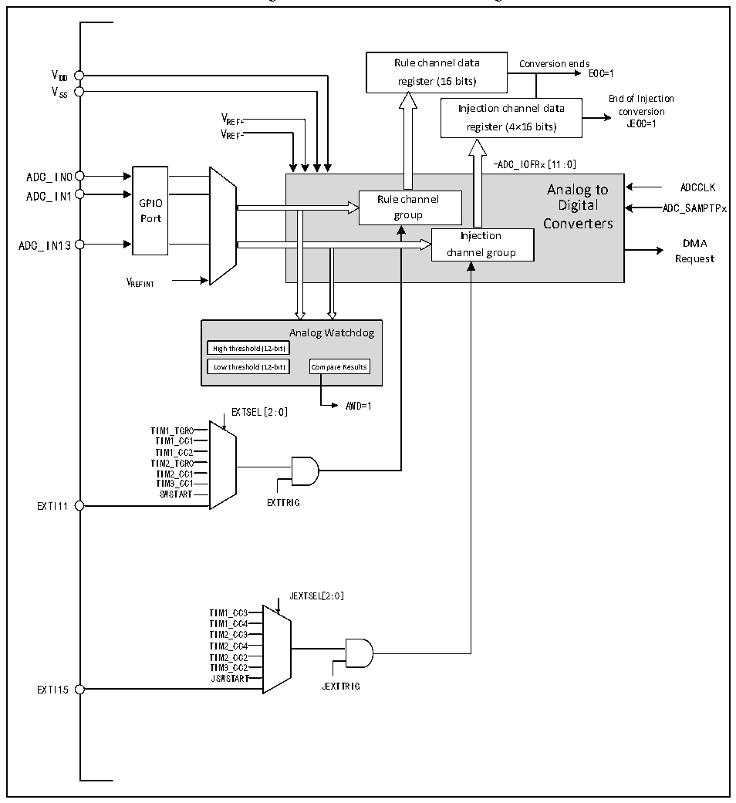

<!-- source-page: 89 -->

[← p.88](0088.md) · [index](../README.md) · [PDF p.89](https://ch32-riscv-ug.github.io/CH32X035/datasheet_en/CH32X035RM.PDF#page=89) · [p.90 →](0090.md)

<!-- header: CH32X035 Reference Manual https://wch-ic.com -->

## 10.2 Functional Description

### 10.2.1 Module Structure

Figure 10-1 ADC module block diagram  
 <!-- rendered from the PDF; verify at https://ch32-riscv-ug.github.io/CH32X035/datasheet_en/CH32X035RM.PDF#page=89 -->

🖼 Text parsed from the figure above

Rule channel data Conversion ends  
V EOC=1  
DD register (16 bits)  
V  
SS End of Injection  
V Injection channel data conversion  
REF+ register (4×16 bits) JEOC=1  
VREF-  
-ADC_IOFRx[11:0]  
GPIOPort  
-ADC_IOFRx[11:0] Analog to Rule channel Digital group Converters Injection channel group  
ADC_IN0  
Analog to ADCCLK  
ADC_IN13 DMA  
Request  
VREFINT  
Analog Watchdog  
High threshold (12-bit)  Low threshold (12-bit)  
AWD=1  
EXTSEL[2:0]  
TIM1_TGR0  
TIM1_CC1  
TIM1_CC2  
TIM2_TGR0  
TIM2_CC1  
TIM3_CC1  
SWSTART  
EXTI11 EXTTRIG  
JEXTSEL[2:0]  
TIM1_CC3  
TIM1_CC4  
TIM2_CC3  
TIM2_CC4  
TIM2_CC2  
TIM3_CC2  
JSWSTART  
EXTI15 JEXTTRIG  

### 10.2.2 ADC Configuration

<strong>1) Module power-up</strong>  
An ADON bit of 1 in the ADC_CTLR2 register indicates that the ADC module is powered up. When the ADC  
module enters the power-up state (ADON=1) from the power-down mode (ADON=0), a delay period tSTAB is  
required for the module stabilization time. After that, the ADON bit is written to 1 again and is used as the start  
signal for software to start the ADC conversion. By clearing the ADON bit to 0, the current conversion can be  
terminated and the ADC module placed in power-down mode, a state in which the ADC consumes almost no  
<!-- image: p89-draw-image-00001 bbox=[511.32, 783.48, 530.76, 793.8] -->
<!-- footer: V1.9 88 -->
