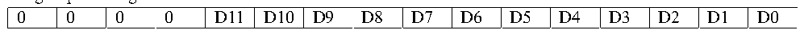

<!-- source-page: 91 -->

[← p.90](0090.md) · [index](../README.md) · [PDF p.91](https://ch32-riscv-ug.github.io/CH32X035/datasheet_en/CH32X035RM.PDF#page=91) · [p.92 →](0092.md)

<!-- header: CH32X035 Reference Manual https://wch-ic.com -->
written after the offset defined in the ADC_IOFRx register, there will be positive and negative cases, so there are  
sign bits (SIGNB).  
<em>Note: Data left alignment applies only when rule groups are used.</em>  

Figure 10-2 Data left alignment  
 <!-- rendered from the PDF; verify at https://ch32-riscv-ug.github.io/CH32X035/datasheet_en/CH32X035RM.PDF#page=91 -->

Rule group data register  

🖼 Text parsed from the figure above

D11  D10  D9  D8  D7  D6  D5  D4  D4  D2  D1  D0  0  0  0  0  

Figure 10-3 Data right alignment  
 <!-- rendered from the PDF; verify at https://ch32-riscv-ug.github.io/CH32X035/datasheet_en/CH32X035RM.PDF#page=91 -->

Rule group data register  

🖼 Text parsed from the figure above

0  0  0  0  D11  D10  D9  D8  D7  D6  D5  D4  D3  D2  D1  D0  

Inject group data register  

<!-- p91-table-003 (table-9-2@1) -->
<table><tr><th>SIGNB</th><th>SIGNB</th><th>SIGNB</th><th>SIGNB</th><th>D11</th><th>D10</th><th>D9</th><th>D8</th><th>D7</th><th>D6</th><th>D5</th><th>D4</th><th>D3</th><th>D2</th><th>D1</th><th>D0</th></tr></table>

### 10.2.3 External Trigger Source

The ADC conversion start event can be triggered by an external event. If the EXTTRIG or JEXTTRIG bits of the  
ADC_CTLR2 register are set, the conversion of a rule group or injection group channel can be triggered by an  
external event, respectively. In this case, the configuration of EXTSEL[2:0] and JEXTSEL[2:0] bits determines  
the external event source for the rule group and injection group.  

<!-- p91-table-004 (table-10-1@1) -->
<table><caption>Table 10-1 External trigger sources for rule group channels</caption><tr><th>EXTSEL[2:0]</th><th>Trigger source</th><th>Type</th></tr><tr><td>000</td><td>TRGO event of timer 1</td><td rowspan="6">Internal signal from on-chip timer</td></tr><tr><td>001</td><td>CC1 event of timer 1</td></tr><tr><td>010</td><td>CC2 event of timer 1</td></tr><tr><td>011</td><td>TRGO event of timer 2</td></tr><tr><td>100</td><td>CC1 event of timer 2</td></tr><tr><td>101</td><td>CC1 event of timer 3</td></tr><tr><td>110</td><td>EXTI line 11</td><td>From external pins</td></tr><tr><td>111</td><td>SWSTART position 1 software trigger</td><td>Software control bits</td></tr></table>

<!-- p91-table-005 (table-10-2@1) -->
<table><caption>Table 10-2 External trigger sources for injection group channels</caption><tr><th>JEXTSEL[2:0]</th><th>Trigger source</th><th>Type</th></tr><tr><td>000</td><td>CH3 event of timer 1</td><td rowspan="6">Internal signal from on-chip timer</td></tr><tr><td>001</td><td>CH4 event of timer 1</td></tr><tr><td>010</td><td>CH3 event of timer 2</td></tr><tr><td>011</td><td>CH4 event of timer 2</td></tr><tr><td>100</td><td>CC2 event of timer 2</td></tr><tr><td>101</td><td>CC2 event of timer 3</td></tr><tr><td>110</td><td>EXTI line 15</td><td>From external pins</td></tr><tr><td>111</td><td>JSWSTART position 1 software trigger</td><td>Software control bits</td></tr></table>

<!-- image: p91-draw-image-00001 bbox=[511.32, 783.48, 530.76, 793.8] -->
<!-- footer: V1.9 90 -->
