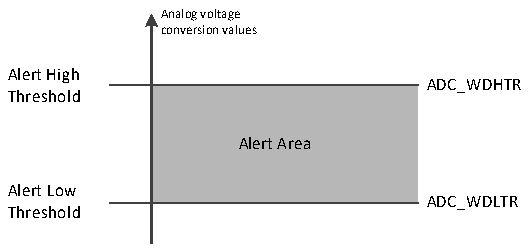

<!-- source-page: 94 -->

[← p.93](0093.md) · [index](../README.md) · [PDF p.94](https://ch32-riscv-ug.github.io/CH32X035/datasheet_en/CH32X035RM.PDF#page=94) · [p.95 →](0095.md)

<!-- header: CH32X035 Reference Manual https://wch-ic.com -->
DISCEN=1, DISCNUM[2:0]=3, L [3:0]=8, channels to be converted = 1, 3, 2, 5, 8, 4, 10, 6  
The 1st external trigger: conversion sequence is: 1, 3, 2  
The 2nd external trigger: conversion sequence is: 5, 8, 4  
The 3rd external trigger: conversion sequence is: 10, 6, while generating EOC events  
The 4th external trigger: conversion sequence is: 1, 3, 2  
Examples of intermittent patterns injected into groups.  
JDISCEN=1, DISCNUM[2:0]=1, JL[1:0]=3, channel to be converted=1, 3, 2  
The 1st external trigger: conversion sequence is: 1  
The 2nd external trigger: the conversion sequence is: 3  
The 3rd external trigger: conversion sequence is: 2, generating both EOC and JEOC events  
The 4th external trigger: conversion sequence is: 1  
<em>Note: 1. When converting a rule group or injection group in intermittent mode, the conversion sequence does not</em>  
<em>automatically start from the beginning when it ends. When all subgroups have been converted, the next trigger</em>  
<em>event starts the conversion of the first subgroup.</em>  
<em>2. You cannot use auto-injection (IAUTO=1) and intermittent mode at the same time.</em>  
<em>3. You cannot set intermittent mode for both rule groups and injection groups, and intermittent mode can</em>  
<em>only be used for a group of conversions.</em>  
<strong>4) Continuous conversion</strong>  
In the continuous conversion mode, another conversion is started as soon as the previous ADC conversion is  
finished, and the conversion does not stop on the last channel of the selection group, but continues again from the  
first channel of the selection group. The startup events for this mode include an external trigger event and ADON  
position 1, which is required to set the CONT position 1 after startup.  
If a rule channel is converted, the conversion data is stored in the ADC_RDATAR register, and the end-of-  
conversion flag EOC is set, generating an interrupt if EOCIE is set.  
If an injection channel is converted, the conversion data is stored in the ADC_IDATARx register, the end-of-  
injection-conversion flag JEOC is set, and an interrupt is generated if JEOCIE is set.  

### 10.2.5 Analog Watchdog

The AWD analog watchdog status bit is set if the analog voltage being converted by the ADC is below the low  
threshold or above the high threshold. The threshold settings are located in the lowest 12 valid bits of the  
ADC_WDHTR and ADC_WDLTR registers. The AWDIE bit of the ADC_CTLR1 register is set to allow the  
corresponding interrupt to be generated.  

Figure 10-4 Analog watchdog threshold area  
 <!-- rendered from the PDF; verify at https://ch32-riscv-ug.github.io/CH32X035/datasheet_en/CH32X035RM.PDF#page=94 -->

🖼 Text parsed from the figure above

Analog voltage  
conversion values  
Alert High  
ADC_WDHTR  
<!-- image: p94-draw-image-00002 inside the figure -->
Threshold  
Alert Area  
Alert Low  
ADC_WDLTR  
Threshold  

Configure the AWDSGL, AWDEN, JAWDEN and AWDCH[3:0] bits of the ADC_CTLR1 register to select the  
<!-- image: p94-draw-image-00001 bbox=[511.32, 783.48, 530.76, 793.8] -->
<!-- footer: V1.9 93 -->
