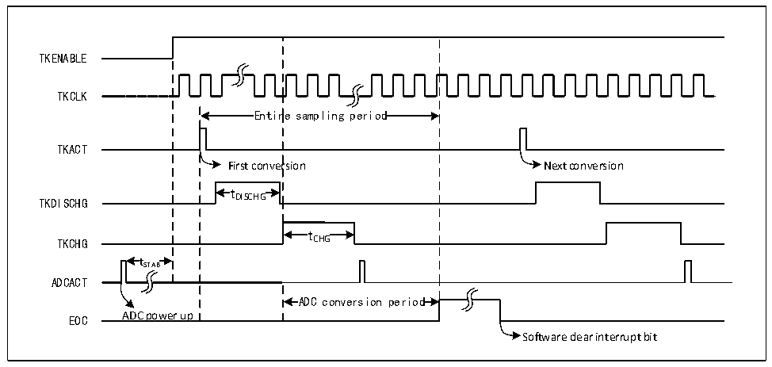

<!-- source-page: 107 -->

[← p.106](0106.md) · [index](../README.md) · [PDF p.107](https://ch32-riscv-ug.github.io/CH32X035/datasheet_en/CH32X035RM.PDF#page=107) · [p.108 →](0108.md)

<!-- header: CH32X035 Reference Manual https://wch-ic.com -->

# Chapter 11 Touch Key Detection (TKEY)

The touch detection control (TKEY) unit, with the aid of the ADC module&#x27;s voltage conversion function,  
implements the touch button detection function by converting the electrical capacity into a voltage quantity for  
sampling. The detection channels are alternate with the 14 external channels of the ADC and the touch button  
detection is achieved by the single conversion mode of the ADC module.  

## 11.1 TKEY Functional Description

● TKEY on  
The TKEY detection process requires the cooperation of the ADC module to carry out, so when using the TKEY  
function, you need to ensure that the ADC module is in the power-on state (ADON=1), then turn on the TKEY  
unit function by setting the TKENABLE position 1 of the ADC_CTLR1 register.  
TKEY only supports single channel conversion mode, configure the channel to be converted to the first of the  
ADC module&#x27;s rule group sequence and the software initiates the conversion (Write the TKEY_ACT_DCG  
register).  
<em>Note: When TKEY conversion is not performed, the ADC channel configuration conversion function can still be</em>  
<em>retained.</em>  

Figure 11-1 TKEY operating timing diagram  
 <!-- rendered from the PDF; verify at https://ch32-riscv-ug.github.io/CH32X035/datasheet_en/CH32X035RM.PDF#page=107 -->

🖼 Text parsed from the figure above

TKENABLE  
TKCLK  
Entir  re sampling period  Entir  re sampling period  
TKACT  
First conversion Next conversion  
t DISCHG  tDISCHG  
TKDISCHG DISCHG  
t CHG  tCHG  
TKCHG CHG  
t  tSTAB  
ADCACT  
ADC conversion period  ADC conversion period  
EOC ADC power up  
Software clear interrupt bit  

● Programmable sampling times  
The TKEY cell conversion requires a discharge using a number of ADCCLK clock cycles (tDISCHG) followed by a  
voltage sample by charging the channel over a number of ADCCLK cycles (tCHG). The number of charging cycles  
is the sum of the TKCGx[2:0] configuration values in the TKEY_CHARGE1 and TKEY_CHARGE2 registers  
plus The sum of the TKEY_CHGOFFSET offsets, each channel can be adjusted separately with a different charge  
cycle to sample the voltage.  
<!-- image: p107-draw-image-00001 bbox=[515.76, 783.48, 535.2, 793.8] -->
<!-- footer: V1.9 106 -->
