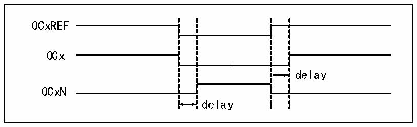

<!-- source-page: 120 -->

[← p.119](0119.md) · [index](../README.md) · [PDF p.120](https://ch32-riscv-ug.github.io/CH32X035/datasheet_en/CH32X035RM.PDF#page=120) · [p.121 →](0121.md)

<!-- header: CH32X035 Reference Manual https://wch-ic.com -->
When edge aligned is used, the core counter is incremented or decremented, and in the PWM mode 1 scenario,  
OCxREF is high when the core counter value is greater than the compare capture register, and low when the core  
counter value is less than the compare capture register (e.g., when the core counter grows to the value of  
R16_TIMx_ATRLR and reverts to all zeros).  
● Center aligned  
When using the center aligned modes, the core counter runs in alternating incremental and decremental count  
modes, and OCxREF makes rising and falling jumps when the values of the core counter and the compare capture  
register match. However, the comparison flags are set at different times in the three central alignment modes.  
When using the center aligned modes, it is best to generate a software update flag (Set the UG bit) before starting  
the core counter.  

### 12.3.7 Complementary Outputs and Dead-time Insertion

The compare capture channel generally has two output pins (Compare capture channel 4 has only one output pin)  
and can output two complementary signals (OCx and OCxN). OCx and OCxN can be independently set for  
polarity via the CCxP and CCxNP bits, independently set for output enable via CCxE and CCxNE, and  
independently set for output enable via the MOE, OIS, OISN, OSSI, and OSSR bits for dead-time and other  
controls. Enabling the OCx and OCxN outputs simultaneously will insert a dead-time, and each channel has a 10-  
bit dead-time generator. OCx and OCxN are generated by the OCxREF association. If both OCx and OCxN are  
high active, then OCx is the same as OCxREF except that the rising edge of OCx is equivalent to OCxREF with a  
delay, and OCxN is the opposite of OCxREF in that its rising edge will have a delay relative to the falling edge of  
the reference signal. If the delay is greater than the effective output width, the corresponding pulse will not be  
generated.  
The relationship between OCx and OCxN and OCxREF is illustrated in Figure 12-4, which shows the dead-time.  

Figure 12-4 Complementary outputs and dead-time insertion  
 <!-- rendered from the PDF; verify at https://ch32-riscv-ug.github.io/CH32X035/datasheet_en/CH32X035RM.PDF#page=120 -->

🖼 Text parsed from the figure above

OCxREF  
OCx  
delay  
OCxN  
delay  

### 12.3.8 Brake Signal

When the brake signal is generated, the output enable signal and invalid level are modified according to the MOE,  
OIS, OISN, OSSI, and OSSR bits. However, OCx and OCxN will not be at the active level at any time. The  
source of the brake event can come from the brake input pin or it can be a clock failure event which is generated  
by the CSS (Clock Safety System).  
After system reset, the brake function is disabled by default (MOE bit is low), and setting the BKE bit enables the  
brake function. The polarity of the input brake signal can be set by setting BKP, and the BKE and BKP signals can  
be written at the same time, and there is a delay of one HB clock before the actual writing, so you need to wait for  
one HB cycle to read the written value correctly.  
At the presence of the selected level on the brake pin the system will generate the following actions.  
1) The MOE bit is cleared asynchronously, setting the output to an invalid, idle or reset state, depending on the  
<!-- image: p120-draw-image-00001 bbox=[515.76, 783.48, 535.2, 793.8] -->
<!-- footer: V1.9 119 -->
