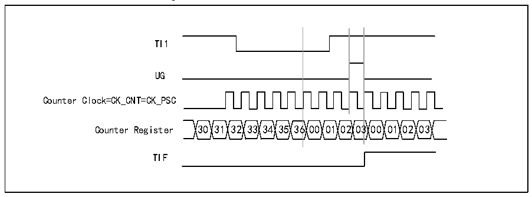
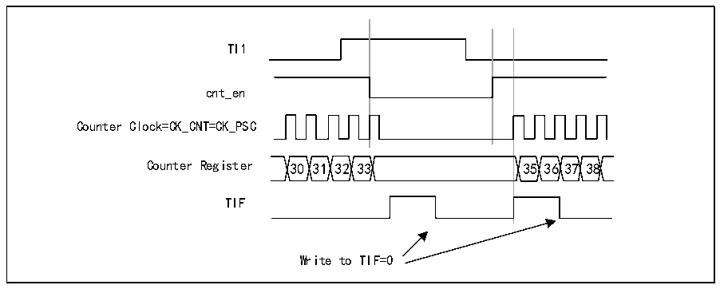

<!-- source-page: 123 -->

[← p.122](0122.md) · [index](../README.md) · [PDF p.123](https://ch32-riscv-ug.github.io/CH32X035/datasheet_en/CH32X035RM.PDF#page=123) · [p.124 →](0124.md)

<!-- header: CH32X035 Reference Manual https://wch-ic.com -->

Figure 12-6 Control circuit in reset mode  
 <!-- rendered from the PDF; verify at https://ch32-riscv-ug.github.io/CH32X035/datasheet_en/CH32X035RM.PDF#page=123 -->

🖼 Text parsed from the figure above

TI1  
UG  
Counter Clock=CK_CNT=CK_PSC  
Counter Register 30 31 32 33 34 35 36 00 01 02 03 00 01 02 03  
TIF  

<strong>Slave mode: Gated mode</strong>  
The level of the input signal enables the counter. In the following example, the counter counts up only when TI1 is  
low:  
1) Configure channel 1 to detect a low level on TI1. Configure the input filter bandwidth (This example does not  
require any filter, so keep IC1F = 0000). There is no need to configure the capture divider as it is not used for  
trigger operation. the CC1S bit selects only the input capture source, i.e. CC1S=01 (in R16_TIMx_CCMR1).  
Write CC1P=1 and CC1NP=&#x27;0&#x27; to the R16_TIMx_CCER register to verify polarity (detect low level only).  
2) Write SMS=101 to R16_TIMx_SMCFGR to configure the timer for gated mode; write TS=101 to  
R16_TIMx_SMCFGR to select TI1 as input source.  
3) Write CEN=1 to R16_TIMx_CTLR1 to start the counter. In gated mode, if CEN=0, the counter will not start  
regardless of the trigger input level.  
As long as TI1 is low, the counter starts counting based on the internal clock and stops counting when TI1 goes  
high. When the counter starts or stops it sets TIF position 1 in R16_TIMx_INTFR. The delay between the rising  
edge of TI1 and the actual counter reset is caused by the resynchronization circuitry at the TI1 input.  

Figure 12-7 Control circuit in gated mode  
 <!-- rendered from the PDF; verify at https://ch32-riscv-ug.github.io/CH32X035/datasheet_en/CH32X035RM.PDF#page=123 -->

🖼 Text parsed from the figure above

TI1  
cnt_en  
Counter Clock=CK_CNT=CK_PSC  
Counter Register 30 31 32 33 35 36 37 38  
TIF  
Write to TIF=0  

<strong>Slave mode: Trigger mode</strong>  
An event on the selected input will enable the counter. In the following example, the up counter is activated when  
a rising edge occurs on the TI2 input:  
1) Configure channel 2 to detect the rising edge of TI2. Configure the input filter bandwidth (This example does  
not require any filter, so keep IC2F = 0000). There is no need to configure the capture divider as it is not used for  
trigger operation. the CC2S bit selects only the input capture source by setting CC2S=01 (In R16_TIMx_CCMR1).  
Write CC2P=1 and CC2NP=&#x27;0&#x27; to the R16_TIMx_CCER register to verify polarity (Detect low level only)  
<!-- image: p123-draw-image-00001 bbox=[515.76, 783.48, 535.2, 793.8] -->
<!-- footer: V1.9 122 -->
