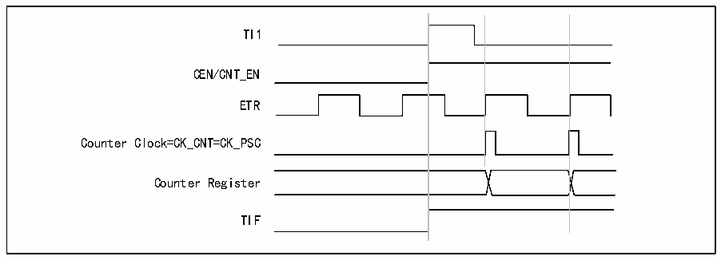
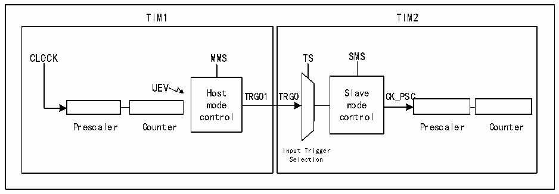

<!-- source-page: 125 -->

[← p.124](0124.md) · [index](../README.md) · [PDF p.125](https://ch32-riscv-ug.github.io/CH32X035/datasheet_en/CH32X035RM.PDF#page=125) · [p.126 →](0126.md)

<!-- header: CH32X035 Reference Manual https://wch-ic.com -->

Figure 12-9 Control circuit in external clock mode 2 + trigger mode  
 <!-- rendered from the PDF; verify at https://ch32-riscv-ug.github.io/CH32X035/datasheet_en/CH32X035RM.PDF#page=125 -->

🖼 Text parsed from the figure above

TI1  
CEN/CNT_EN  
ETR  
Counter Clock=CK_CNT=CK_PSC  
Counter Register  
TIF  

### 12.3.12 Timer Synchronization Mode

The TIMx timers are connected together from within to synchronize or cascade the timers. When a timer is  
configured in master mode, the counter of another timer configured in slave mode can be reset, started, stopped or  
clocked.  
<strong>Using one timer as a prescaler for another timer</strong>  

Figure 12-10 Master/slave timer example  
 <!-- rendered from the PDF; verify at https://ch32-riscv-ug.github.io/CH32X035/datasheet_en/CH32X035RM.PDF#page=125 -->

🖼 Text parsed from the figure above

TIM1 TIM2  
CLOCK MMS TS SMS  
UEV  
Host TRGO1 TRGO Slave CK_PSC  
mode mode  
control control  
Prescaler Counter Prescaler Counter  
Input Trigger  
Selection  

For example, timer 1 can be configured as a prescaler for timer 2. To do this:  
1) Configure Timer 1 in Master mode to output a periodic trigger signal every time an update event UEV occurs.  
If MMS=010 is written to R16_TIM1_CTLR2, TRGO1 will output a rising edge whenever an update event is  
generated.  
2) To connect the TRGO1 output of Timer 1 to Timer 2, Timer 2 must be configured in slave mode, using ITR0 as  
the internal trigger. This can be selected via the TS bit in the R16_TIM2_SMCFGR register (Write TS=000).  
3) The slave mode controller is then set to external clock mode 1 (Write SMS=111 in the R16_TIM2_SMCFGR  
register). In this way the clock for timer 2 will be supplied by the rising edge of the periodic trigger signal of timer  
1 (Corresponding to the counter overflow of timer 1).  
4) Finally both timers must be enabled simultaneously by setting the corresponding CEN bits  
(R16_TIMx_CTLR1 register) of both timers to 1.  
<em>Note: If the OCx signal of timer 1 is selected as trigger output (MMS=1xx), the rising edge of this signal will be</em>  
<em>used to drive the counter of timer 2.</em>  
<strong>Using one timer to enable another timer</strong>  
In this example Timer 2 is enabled by comparing the output of Timer 1 with 1. Timer 2 counts according to the  
<!-- image: p125-draw-image-00001 bbox=[515.76, 783.48, 535.2, 793.8] -->
<!-- footer: V1.9 124 -->
