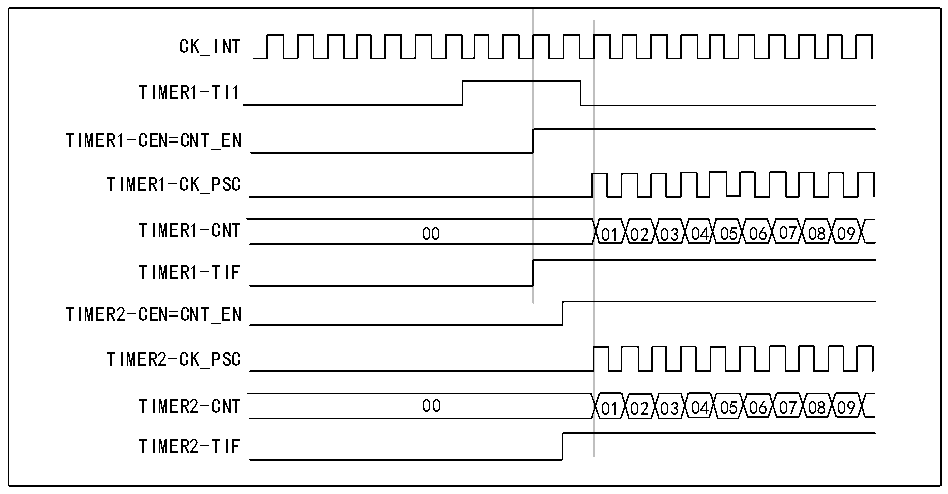

<!-- source-page: 129 -->

[← p.128](0128.md) · [index](../README.md) · [PDF p.129](https://ch32-riscv-ug.github.io/CH32X035/datasheet_en/CH32X035RM.PDF#page=129) · [p.130 →](0130.md)

<!-- header: CH32X035 Reference Manual https://wch-ic.com -->
<strong>Synchronized start of 2 timers using an external trigger</strong>  
In this example, Timer 1 is enabled when there is a rising edge on the TI1 input of Timer 1, and Timer 2 is enabled  
at the same time as Timer 1. To ensure that the two counters are aligned, Timer 1 must be configured in  
master/slave mode (Corresponding to TI1 as slave and Timer 2 as master):  
1) Configure Timer 1 in Master mode, sending its enable signal as a trigger output (MMS=001 in the  
R16_TIM1_CTLR2 register).  
2) Configure Timer 1 as Slave mode to receive the input trigger from TI1 (TS=100 in R16_TIM1_SMCFGR  
register).  
3) Configure Timer 1 to trigger mode (SMS=110 in the R16_TIM1_SMCFGR register).  
4) Configure Timer 1 to Master/Slave mode by writing MSM=1 (R16_TIMx_SMCR register).  
5) Configure Timer 2 to receive an input trigger from Timer 1 (TS=000 in R16_TIM2_SMCFGR register).  
6) Configure Timer 2 to trigger mode (SMS=110 in the R16_TIM2_SMCFGR register).  
When a rising edge occurs on TI1 (Timer 1), both counters start counting synchronously according to the internal  
clock and both TIF flags are set to 1.  
<em>Note: In this example, both timers are initialized (By setting their respective UG positions to 1) prior to start-up.</em>  
<em>Both counters count from 0, but an offset can easily be inserted between the two by writing to either counter</em>  
<em>register (R16_TIMx_CNT). It may be noted that the master/slave mode creates a delay between CNT_EN and</em>  
<em>CK_PSC for timer 1.</em>  

Figure 12-15 Triggering Timer 1 and Timer 2 using Timer 1&#x27;s TI1 input  
 <!-- rendered from the PDF; verify at https://ch32-riscv-ug.github.io/CH32X035/datasheet_en/CH32X035RM.PDF#page=129 -->

🖼 Text parsed from the figure above

CK_INT  
TIMER1-TI1  
TIMER1-CEN=CNT_EN  
TIMER1-CK_PSC  
TIMER1-CNT 00 01 02 03 04 05 06 07 08 09  
TIMER1-TIF  
TIMER2-CEN=CNT_EN  
TIMER2-CK_PSC  
TIMER2-CNT 00 01 02 03 04 05 06 07 08 09  
TIMER2-TIF  

Timers are capable of outputting clock pulses (TRGO) and also receiving inputs from other timers (ITRx). The  
source of ITRx (TRGO from other timers) is different for different timers. The timer internal trigger connections  
are shown in Table 12-2.  

<!-- p129-table-002 (table-12-2@1) -->
<table><caption>Table 12-2 TIMx internal trigger connections</caption><tr><th>Slave timer</th><th>ITR0(TS=000)</th><th>ITR1(TS=001)</th><th>ITR2(TS=010)</th><th>ITR3(TS=011)</th></tr><tr><td>TIM1</td><td>0</td><td>TIM2_TRGO</td><td>0</td><td>0</td></tr><tr><td>TIM2</td><td>TIM1_TRGO</td><td>0</td><td>0</td><td>0</td></tr></table>

<!-- image: p129-draw-image-00001 bbox=[515.76, 783.48, 535.2, 793.8] -->
<!-- footer: V1.9 128 -->
