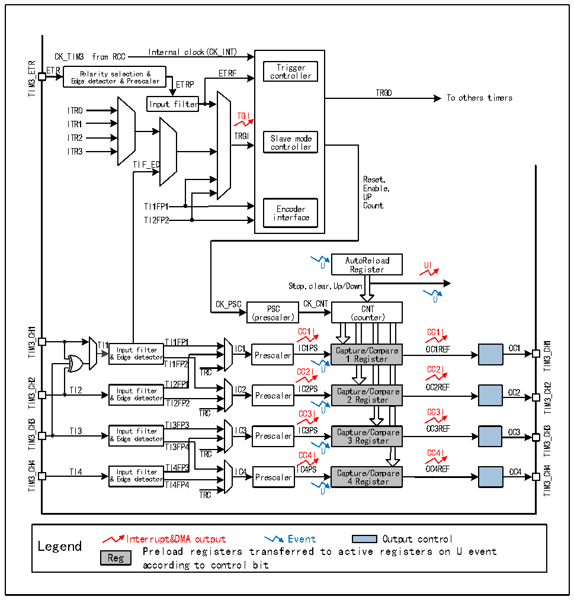

<!-- source-page: 150 -->

[← p.149](0149.md) · [index](../README.md) · [PDF p.150](https://ch32-riscv-ug.github.io/CH32X035/datasheet_en/CH32X035RM.PDF#page=150) · [p.151 →](0151.md)

<!-- header: CH32X035 Reference Manual https://wch-ic.com -->

## 13.2 Principle and Structure

Figure 13-1 Block diagram of the structure of the general-purpose timer  
 <!-- rendered from the PDF; verify at https://ch32-riscv-ug.github.io/CH32X035/datasheet_en/CH32X035RM.PDF#page=150 -->

🖼 Text parsed from the figure above

Internal clock(CK_INT)  
CK_TIM3 from RCC  
TIM3_ETR  
ETR Polarity selection &amp; ETRF co T n r t i r g o g l e l r e r  
Polarity selection &amp; Edge detector &amp; Prescaler  
TRGO  
To others timers  
Input filter  
ITR0  
TGI  
ITR1  
ITR2 TRGI Slave mode  
controller  
ITR3  
TIF_ED  
Reset,  
Enable,  
UP  
TI1FP1 Encoder Count  
TI2FP2 interface  
AutoReload  
U Register UI  
Stop,clear,Up/Down  
U  
CK_PSC CK_CNT  
PSC CNT  
(prescaler) (counter)  
TIM3_CH1  
CC1I CC1I  
TI1 Input filter TI1FP1 IC1 IICC11PPSS Capture/Compare OC1REF OC1  
TIM3_CH1  
&amp; Edge detector Prescaler 1 Register  
TI1FP2  
TRC CC2I U CC2I  
TIM3_CH2  
TI2 &amp; I E n d p g u e t d f e i t l e t c e t r o r T T I I 2 2 F F P P 1 2 IC2 Prescaler IC2PS Cap 2 t u R r e e g / i C s o t m e p r are OC2REF OC2  
TIM3_CH2  
TRC CC3I U CC3I  
TIM3_CH3  
TI3 &amp; I E n d p g u e t d f e i t l e t c e t r o r TI3FP3 IC3 Prescaler IC3PS Cap 3 t u R r e e g / i C s o t m e p r are OC3REF OC3  
TIM3_CH3  
TI3FP4  
TRC CC4I U CC4I  
TIM3_CH4  
TI4 Input filter TI4FP3 IC4 IC4PS Capture/Compare OC4REF OC4  
TIM3_CH4  
&amp; Edge detector Prescaler 4 Register  
TI4FP4  
TRC U  
Interrupt&amp;DMA output Event Output control  
Legend  
Preload registers transferred to active registers on U event  
Reg  
according to control bit  

### 13.2.1 Overview

As shown in Figure 13-1, the structure of the general-purpose timer can be roughly divided into three parts,  
namely the input clock part, the core counter part and the compare capture channel part.  
The clock for the general-purpose timer can come from the HB bus clock (CK_INT), from the external clock  
input pin (TIMx_ETR), from other timers with clock output (ITRx), and from the input of the compare capture  
channel (TIMx_CHx). These input clock signals become CK_PSC clocks after various set filtering and dividing  
operations, etc., and are output to the core counter section. In addition, these complex clock sources can also be  
output as TRGO to other peripherals such as timers and ADCs.  
The core of the general-purpose timer is a 16-bit counter (CNT). CK_PSC is divided by a prescaler (PSC) to  
<!-- image: p150-draw-image-00001 bbox=[515.76, 783.48, 535.2, 793.8] -->
<!-- footer: V1.9 149 -->
