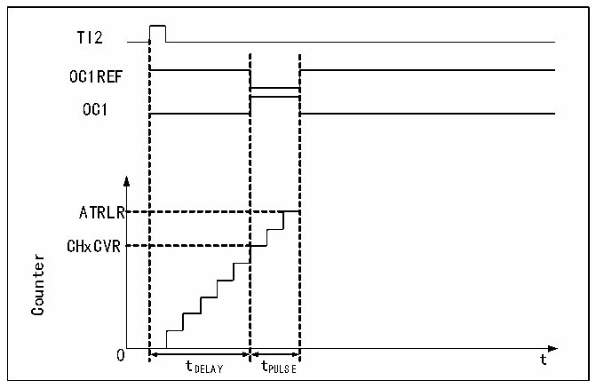

<!-- source-page: 156 -->

[← p.155](0155.md) · [index](../README.md) · [PDF p.156](https://ch32-riscv-ug.github.io/CH32X035/datasheet_en/CH32X035RM.PDF#page=156) · [p.157 →](0157.md)

<!-- header: CH32X035 Reference Manual https://wch-ic.com -->
3) Set TI1 (TI1FP2) as the input of IC2 signal. Set CC2S to 10b.  
4) Select TI1FP2 to set to falling edge active. Set CC2P to 1.  
5) Select TI1FP1 as the source of the clock source. set TS to 101b.  
6) Set the SMS to reset mode, i.e. 100b.  
7) Enables input capture. CC1E and CC2E are set.  
<em>Note: Since only TI1FP1 and TI2FP2 are connected to the slave mode controller, only TIM3_CH1/TIM3_CH2 can</em>  
<em>be used in the PWM input mode.</em>  

### 13.3.6 PWM Output Mode

PWM output mode is one of the basic functions of the timer. PWM output mode is most commonly used to  
determine the PWM frequency using the reload value and the duty cycle using the capture comparison register.  
Set 110b or 111b in the OCxM field to use PWM mode 1 or mode 2, set the OCxPE bit to enable the preload  
register, and finally set the ARPE bit to enable the automatic reload of the preload register. The value of the  
preload register can only be sent to the shadow register when an update event occurs, so the UG bit needs to be set  
to initialize all registers before the core counter starts counting.  

### 13.3.7 Single Pulse Mode

The single pulse mode can respond to a specific event by generating a pulse after a delay, with programmable  
delay and pulse width. Setting the OPM bit stops the core counter when the next update event UEV is generated  
(Counter flips to 0).  

Figure 13-4 Event generation and impulse response  
 <!-- rendered from the PDF; verify at https://ch32-riscv-ug.github.io/CH32X035/datasheet_en/CH32X035RM.PDF#page=156 -->

🖼 Text parsed from the figure above

TI2  
OC1REF  
OC1  
ATRLR  
CHxCVR  
Counter  
0 t  
tDELAY tPULSE  

As shown in Figure 13-4, a positive pulse of length Tpulse needs to be generated on OC1 after a delay Tdelay at  
the beginning of a rising edge detected on the TI2 input pin.  
1) Set TI2 to trigger. Setting the CC2S field to 01b to map TI2FP2 to TI2; setting the CC2P bit to 0b to set  
TI2FP2 as rising edge detection; setting the TS field to 110b to set TI2FP2 as trigger source; setting the SMS  
field to 110b to set TI2FP2 to be used to start the counter.  
2) Tdelay is defined by the Compare Capture Register and Tpulse is determined by the value of the Auto Reload  
Value Register and the Compare Capture Register.  
<!-- image: p156-draw-image-00001 bbox=[515.76, 783.48, 535.2, 793.8] -->
<!-- footer: V1.9 155 -->
