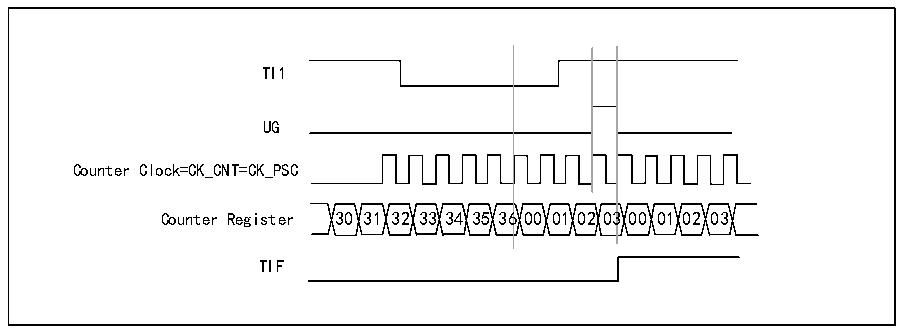

<!-- source-page: 157 -->

[← p.156](0156.md) · [index](../README.md) · [PDF p.157](https://ch32-riscv-ug.github.io/CH32X035/datasheet_en/CH32X035RM.PDF#page=157) · [p.158 →](0158.md)

<!-- header: CH32X035 Reference Manual https://wch-ic.com -->

### 13.3.8 Synchronization of TIMx Timers and External Triggers

The timer can be synchronized with an external trigger in reset mode, gated mode and trigger mode.  
<strong>Slave mode: reset mode</strong>  
The counter and its prescaler can be reinitialized in response to a trigger input event; if the URS bit of the  
R16_TIMx_CTLR1 register is low, an update event UEV is generated; all preload registers (R16_TIMx_ATRLR,  
R16_TIMx_CHxCVR) are then updated.  
In the following example, the up counter is cleared to zero when a rising edge occurs on the TI1 input:  
1) Configure channel 1 to detect the rising edge of TI1. Configure the input filter bandwidth (This example does  
not require any filter, so keep IC1F = 0000). There is no need to configure the capture divider as it is not used for  
trigger operation. the CC1S bit selects only the input capture source, i.e. CC1S=01 (In R16_TIMx_CCMR1).  
Write CC1P=0 and CC1NP=&#x27;0&#x27; to the R16_TIMx_CCER register to verify polarity (Rising edge detection only).  
2) Write SMS=100 to R16_TIMx_SMCFGR to configure the timer to reset mode; write TS=101 to  
R16_TIMx_SMCFGR to select TI1 as input source.  
3) Write CEN=1 to R16_TIMx_CTLR1 to start the counter.  
The counter counts using the internal clock and then runs normally, when there is a TI1 rising edge the counter  
clears and starts counting again from 0. At the same time, the trigger flag TIF position 1, after enabling interrupt  
or DMA, allows an interrupt or DMA request to be sent. (Depends on the TIE (Interrupt Enable) bit and TDE  
(DMA Enable) bit in the R16_TIMx_DMAINTENR register).  
The diagram below shows the action when the auto-reload register R16_TIMx_ARR = 0x36. The delay between  
the rising edge of TI1 and the actual counter reset is caused by the resynchronization circuitry at the TI1 input.  

Figure 13-5 Control circuit in reset mode  
 <!-- rendered from the PDF; verify at https://ch32-riscv-ug.github.io/CH32X035/datasheet_en/CH32X035RM.PDF#page=157 -->

🖼 Text parsed from the figure above

TI1  
UG  
Counter Clock=CK_CNT=CK_PSC  
Counter Register 30 31 32 33 34 35 36 00 01 02 03 00 01 02 03  
TIF  

<strong>Slave mode: Gated mode</strong>  
The level of the input signal enables the counter. In the following example, the counter counts up only when TI1 is  
low:  
1) Configure channel 1 to detect a low level on TI1. Configure the input filter bandwidth (This example does not  
require any filter, so keep IC1F = 0000). There is no need to configure the capture divider as it is not used for  
trigger operation. the CC1S bit selects only the input capture source, i.e. CC1S=01 (In R16_TIMx_CCMR1).  
Write CC1P=1 and CC1NP=&#x27;0&#x27; to the R16_TIMx_CCER register to verify polarity (Detect low level only).  
2) Write SMS=101 to R16_TIMx_SMCFGR to configure the timer for gated mode; write TS=101 to  
R16_TIMx_SMCFGR to select TI1 as input source.  
3) Write CEN=1 to R16_TIMx_CTLR1 to start the counter. In gated mode, if CEN=0, the counter will not start  
regardless of the trigger input level.  
As long as TI1 is low, the counter starts counting based on the internal clock and stops counting when TI1 goes  
<!-- image: p157-draw-image-00001 bbox=[515.76, 783.48, 535.2, 793.8] -->
<!-- footer: V1.9 156 -->
