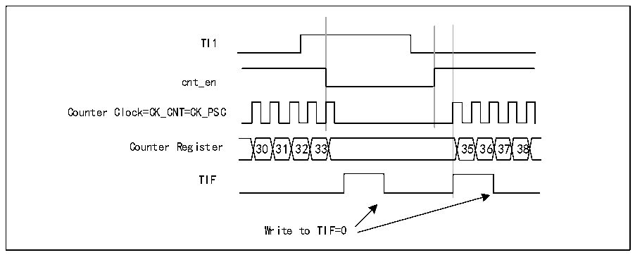
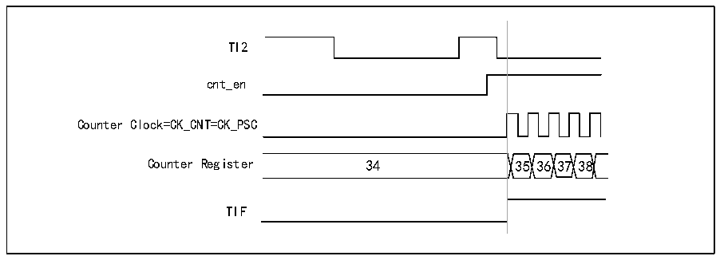

<!-- source-page: 158 -->

[← p.157](0157.md) · [index](../README.md) · [PDF p.158](https://ch32-riscv-ug.github.io/CH32X035/datasheet_en/CH32X035RM.PDF#page=158) · [p.159 →](0159.md)

<!-- header: CH32X035 Reference Manual https://wch-ic.com -->
high. When the counter starts or stops it sets TIF position 1 in R16_TIMx_INTFR. The delay between the rising  
edge of TI1 and the actual counter reset is caused by the resynchronization circuitry at the TI1 input.  

Figure 13-6 Control circuit in gated mode  
 <!-- rendered from the PDF; verify at https://ch32-riscv-ug.github.io/CH32X035/datasheet_en/CH32X035RM.PDF#page=158 -->

🖼 Text parsed from the figure above

TI1  
cnt_en  
Counter Clock=CK_CNT=CK_PSC  
Counter Register 30 31 32 33 35 36 37 38  
TIF  
Write to TIF=0  

<strong>Slave mode: trigger mode</strong>  
An event on the selected input will enable the counter. In the following example, the up counter is activated when  
a rising edge occurs on the TI2 input:  
1) Configure channel 2 to detect the rising edge of TI2. Configure the input filter bandwidth (This example does  
not require any filter, so keep IC2F = 0000). There is no need to configure the capture divider as it is not used for  
trigger operation. the CC2S bit selects only the input capture source by setting CC2S=01 (In R16_TIMx_CCMR1).  
Write CC2P=1 and CC2NP=&#x27;0&#x27; to the R16_TIMx_CCER register to verify polarity (Detect low level only)  
2) Write SMS=110 to R16_TIMx_SMCFGR register to configure the timer to trigger mode; write TS=110 to  
R16_TIMx_SMCFGR register to select TI2 as input source.  
When there is a rising edge of TI2, the counter starts counting driven by the internal clock, while TIF is set to 1.  
The delay between the rising edge of TI2 and the actual counter start is caused by the resynchronization circuitry  
at the TI2 input.  

Figure 13-7 Control circuit in trigger mode  
 <!-- rendered from the PDF; verify at https://ch32-riscv-ug.github.io/CH32X035/datasheet_en/CH32X035RM.PDF#page=158 -->

🖼 Text parsed from the figure above

TI2  
cnt_en  
Counter Clock=CK_CNT=CK_PSC  
Counter Register 34 35 36 37 38  
TIF  

### 13.3.10 Debug mode

When the system enters the debug mode, the timer can be controlled to continue running or stop according to the  
setting of DBG module.  
<!-- image: p158-draw-image-00001 bbox=[515.76, 783.48, 535.2, 793.8] -->
<!-- footer: V1.9 157 -->
