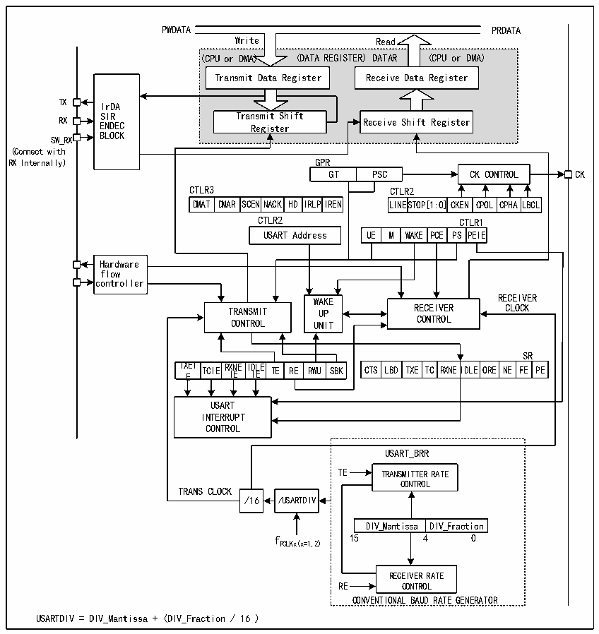

<!-- source-page: 170 -->

[← p.169](0169.md) · [index](../README.md) · [PDF p.170](https://ch32-riscv-ug.github.io/CH32X035/datasheet_en/CH32X035RM.PDF#page=170) · [p.171 →](0171.md)

<!-- header: CH32X035 Reference Manual https://wch-ic.com -->

## 14.2 Overview

Figure 14-1 Block diagram of a general-purpose synchronous/asynchronous transceiver  
 <!-- rendered from the PDF; verify at https://ch32-riscv-ug.github.io/CH32X035/datasheet_en/CH32X035RM.PDF#page=170 -->

🖼 Text parsed from the figure above

PWDATA PRDATA  
<!-- image: p170-draw-image-00005 inside the figure -->
<!-- image: p170-draw-image-00004 inside the figure -->
Write Read  
(CPU or DMA) (DATA REGISTER) DATAR (CPU or DMA)  
Transmit Data Register  
Transmit Data Register Receive Data Register  
<!-- image: p170-draw-image-00006 inside the figure -->
<!-- image: p170-draw-image-00003 inside the figure -->
TX IrDA  
SIR Transmit Shift  
RX ENDEC Register Receive Shift Register  
BLOCK  
SW_RX  
(Connect with  
RX Internally) GPR  
GT PSC CK CONTROL CK  
CTLR3 CTLR2  
DMAT  DMAR  SCENNAC  ACK HD  IRLPI  
LINESTO  TOP[1:0]  CKEN  CPOL  CPHA  LBCL  
DMAT DMAR SCENNACK HD IRLPIREN LINESTOP[1:0]CKEN CPOL CPHALBCL  
CTLR2 CTLR1  
WAK  KE PCE  PSCTPLER  ERI1E  
Hardware  
flow  
<!-- image: p170-draw-image-00002 inside the figure -->
controller  
WWAAKKEE RECEIVER  
TRANSMIT UUPP RECEIVER CLOCK  
CONTROL UUNNIITT CONTROL  
TXEIE  TCIE  RXNEIIE  I I DL E E  TE RE  RWU  
SR  
CTS LBD  TXE  TC  RXNE  IDLE  ORE  NE  FE  PE  
USART  
INTERRUPT  
CONTROL  
USART_BRR  
TE TRANSMITTER RATE  
CONTROL  
TRANS CLOCK  
/16 /USARTDIV  
DIV_Mantissa  DIV_Fraction  
f 15 4 0  
PCLKx(x=1,2)  
RECEIVER RATE  
RE CONTROL  
CONVENTIONAL BAUD RATE GENERATOR  
USARTDIV = DIV_Mantissa + (DIV_Fraction / 16 )  

When TE (Transmit enable bit) is set, the data in the transmit shift register is output on the TX pin and the clock is  
output on the CK pin. When transmitting, the first bit shifted out is the least significant bit and each data frame  
starts with a low start bit, then the transmitter sends an 8- or 9-bit data word depending on the setting on the M  
(Word length) bit, and finally a configurable number of stop bits. If equipped with a parity check bit, the last bit of  
the data word is the check bit. After the TE is set an idle frame is sent, which is 10 or 11 bits high and contains the  
stop bit. The disconnect frame is 10 or 11 bits low followed by the stop bit.  

## 14.3 Baud Rate Generator

The baud rate of the transceiver = HCLK/(16*USARTDIV), HCLK is the clock of HB. The value of USARTDIV  
is determined by the two fields DIV_M and DIV_F in USART_BRR, which is calculated by the formula. The  
formula is as follows.  
USARTDIV = DIV_M+(DIV_F/16)  
<!-- image: p170-draw-image-00001 bbox=[515.76, 783.48, 535.2, 793.8] -->
<!-- footer: V1.9 169 -->
