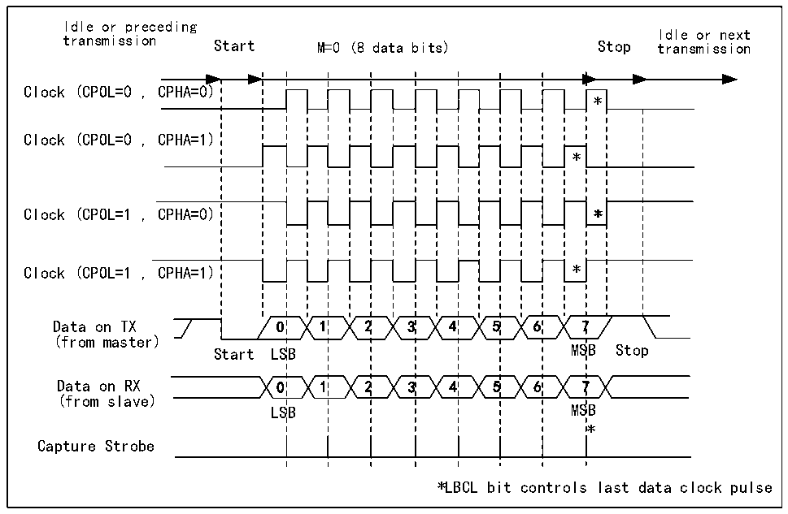
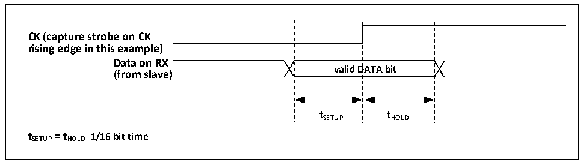

<!-- source-page: 172 -->

[← p.171](0171.md) · [index](../README.md) · [PDF p.172](https://ch32-riscv-ug.github.io/CH32X035/datasheet_en/CH32X035RM.PDF#page=172) · [p.173 →](0173.md)

<!-- header: CH32X035 Reference Manual https://wch-ic.com -->

Figure 14-2 USART clock timing example (M=0)  
 <!-- rendered from the PDF; verify at https://ch32-riscv-ug.github.io/CH32X035/datasheet_en/CH32X035RM.PDF#page=172 -->

🖼 Text parsed from the figure above

Idle or preceding  
Idle or next  
transmission Start M=0 (8 data bits) Stop transmission  
1SB1SB  22  3 2 3  4 3 4  55  6 5 6  * * 7MS7MS  
Clock (CPOL=0 , CPHA=0)  
*  **  7  
Clock (CPOL=0 , CPHA=1)  
(from master)  
(from slave)  
LSB MSB  
*  
Capture Strobe  
*LBCL bit controls last data clock pulse  

Figure 14-3 Data sample hold time  
 <!-- rendered from the PDF; verify at https://ch32-riscv-ug.github.io/CH32X035/datasheet_en/CH32X035RM.PDF#page=172 -->

🖼 Text parsed from the figure above

valid  DATA bit  
<strong>CK (capture strobe on CK</strong>  
<strong>rising edge in this example)</strong>  
<strong>Data on RX</strong>  
<strong>(from slave)</strong>  
<strong>tSETUP tHOLD</strong>  
<strong>tSETUP= tHOLD 1/16 bit time</strong>  

## 14.5 1-Wire Half-Duplex Mode

Half-duplex mode supports the use of a single pin (TX pin only) for receive and transmit, with the TX and RX  
pins connected internally on the chip.  
The way to turn on the half-duplex mode is to set the HDSEL position bit in control register 3  
(R16_USARTx_CTLR3), but it is also necessary to turn off the LIN mode, smart card mode, IR mode and  
synchronous mode, i.e. to ensure that the SCEN, CLKEN and IREN bits are in reset, which are in control registers  
2 and 3 (R16_USARTx_CTLR2 and R16_USARTx_CTLR3).  
After setting to half-duplex mode, you need to set the IO port of the TX to output mode plus pull. With TE set,  
data will be sent out as soon as it is written to the data register. In particular, note that half-duplex mode may cause  
bus conflicts when multiple devices use a single bus to send and receive, which needs to be avoided by the user  
<!-- image: p172-draw-image-00001 bbox=[515.76, 783.48, 535.2, 793.8] -->
<!-- footer: V1.9 171 -->
