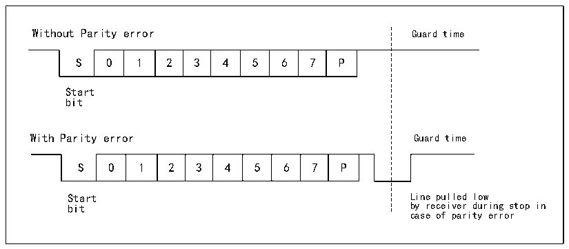

<!-- source-page: 173 -->

[← p.172](0172.md) · [index](../README.md) · [PDF p.173](https://ch32-riscv-ug.github.io/CH32X035/datasheet_en/CH32X035RM.PDF#page=173) · [p.174 →](0174.md)

<!-- header: CH32X035 Reference Manual https://wch-ic.com -->
with the software itself.  

## 14.6 Smart Card

Smart card mode supports ISO7816-3 protocol access to smart card controllers.  
The smart card mode is turned on by setting the SCEN position bit in control register 3 (R16_USARTx_CTLR3),  
but it is also necessary to turn off LIN mode, half duplex mode and IR mode, i.e. to ensure that the LINEN,  
HDSEL and IREN bits are in reset, but CLKEN can be turned on to output the clock, these bits are in control  
registers 2 and 3 (R16_USARTx_CTLR2 and R16_USARTx_CTLR3).  
To support smart card mode, USART should be set to 8 bits of data plus 1 bit of parity, and its stop bit is  
recommended to be configured to 1.5 bits for both transmit and receive. Smart card mode is a single-wire half-  
duplex protocol that uses the TX line for data communication and should be configured as output pull-up. When  
the receiver receives a frame of data and detects a parity error, it sends a NACK signal, i.e., it actively pulls the  
TX down by one cycle during the stop bit, and the sender detects the NACK signal, which generates a frame error  
whereby the application can retransmit. Figure 14-4 shows the waveforms on the TX pin in the correct case and in  
the case of a parity error. the TC flag (Transmit complete flag) of the USART can delay the GT (Protection time)  
generation by one clock, and the receiver will not recognize the NACK signal it sets as the start bit.  

Figure 14-4 (Un)Occurrence of parity error diagram  
 <!-- rendered from the PDF; verify at https://ch32-riscv-ug.github.io/CH32X035/datasheet_en/CH32X035RM.PDF#page=173 -->

🖼 Text parsed from the figure above

Without Parity error Guard time  
0  1  2  3  4  5  6  7  P  
Start  
bit  
With Parity error Guard time  
0  1  2  3  4  5  6  7  P  
Start Line pulled low  
bit by receiver during stop in  
case of parity error  

In smart card mode, the waveform output from the CK pin when enabled has nothing to do with communication;  
it simply clocks the smart card with the value of the HB clock followed by a five-bit settable clock division  
(Twice the value of the PSC, up to 62 divisions).  

## 14.7 IrDA

The USART module supports control of IrDA infrared transceivers for physical layer communication. The LINEN,  
STOP, CLKEN, SCEN and HDSEL bits must be cleared to use IrDA. NRZ (Non-return to zero) coding is used  
between the USART module and the SIR physical layer (Infrared transceiver) and is supported up to 115200 bps  
rates.  
IrDA is a half-duplex protocol, if UASRT is sending data to SIR physical layer, then IrDA decoder will ignore the  
newly sent IR signal, if USART is receiving data from SIR, then SIR will not accept the signal from USART. the  
level logic of USART to SIR and SIR to USART is different. In SIR receive logic, the high level is 1 and the low  
level is 0, but in SIR send logic, the high level is 0 and the low level is 1.  
<!-- image: p173-draw-image-00001 bbox=[515.76, 783.48, 535.2, 793.8] -->
<!-- footer: V1.9 172 -->
