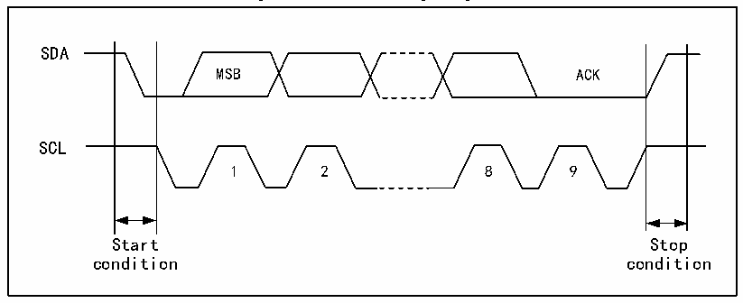

<!-- source-page: 182 -->

[← p.181](0181.md) · [index](../README.md) · [PDF p.182](https://ch32-riscv-ug.github.io/CH32X035/datasheet_en/CH32X035RM.PDF#page=182) · [p.183 →](0183.md)

<!-- header: CH32X035 Reference Manual https://wch-ic.com -->

# Chapter 15 Inter-integrated Circuit (I2C) interface

The internal integrated circuit bus (I2C or IIC) is widely used for communication between microcontrollers and  
sensors and other off-chip modules. It inherently supports multi-master and multi-slave modes and can  
communicate at 100KHz (Standard) and 400KHz (Fast) using just two wires (SDA and SCL).  

## 15.1 Main Features

● Support master and slave modes, support multiple masters and slave.  
● Support two speed modes: 100KHz and 400KHz, compatible with the I2C 2-wire serial bus specification.  
● Support 7-bit or 10-bit addresses.  
● Slave devices support dual 7-bit addresses.  
● Support bus broadcast.  
● Support PEC.  
● Support bus arbitration, error detection, PEC checksum, extended clock.  

## 15.2 Overview

I2C is a half-duplex bus that can only operate in one of the following four modes at the same time: master device  
transmit mode, master device receive mode, slave device transmit mode and slave device receive mode. the I2C  
module works in slave mode by default and automatically switches to master mode when a start condition is  
generated and to slave mode when arbitration is lost or a stop signal is generated. the I2C module supports multi-  
master functionality. When working in master mode, the I2C module actively emits data and addresses. Both data  
and address are transmitted in 8-bit units, with the high bit before and the low bit after. After the start event is a  
one-byte (In 7-bit address mode) or two-byte (In 10-bit address mode) address, and for every 8-bit data or address  
sent by the host, the slave needs to reply with an answer ACK, which pulls the SDA bus low, as shown in Figure  
13-1.  

Figure 15-1 I2C Timing Diagram  
 <!-- rendered from the PDF; verify at https://ch32-riscv-ug.github.io/CH32X035/datasheet_en/CH32X035RM.PDF#page=182 -->

🖼 Text parsed from the figure above

SDA  
MSB ACK  
SCL  
1 2 8 9  
Start Stop  
condition condition  

## 15.3 Master Mode

In master mode, the I2C module dominates the data transfer and outputs the clock signal, and the data transfer  
<!-- image: p182-draw-image-00001 bbox=[515.76, 783.48, 535.2, 793.8] -->
<!-- footer: V1.9 181 -->
