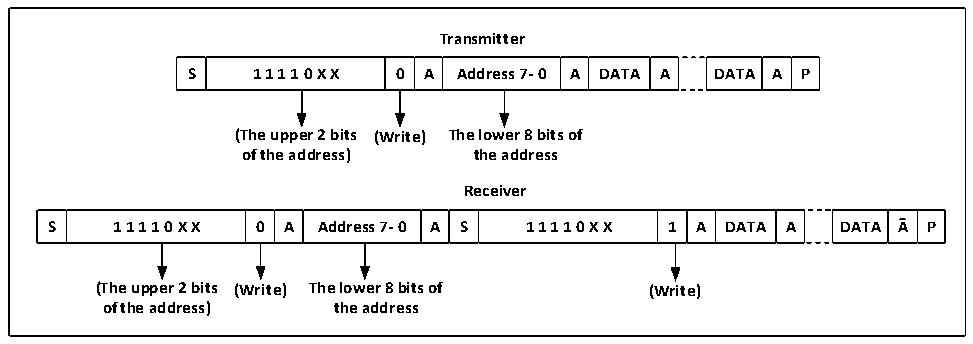

<!-- source-page: 183 -->

[← p.182](0182.md) · [index](../README.md) · [PDF p.183](https://ch32-riscv-ug.github.io/CH32X035/datasheet_en/CH32X035RM.PDF#page=183) · [p.184 →](0184.md)

<!-- header: CH32X035 Reference Manual https://wch-ic.com -->
starts with a start event and ends with an end event. The steps to use master mode communication are:  
1) Setting the correct clock in control register 2 (R16_I2C1_CTLR2) and clock control register  
(R16_I2C1_CKCFGR).  
2) Setting the PE bit in the control register (R16_I2C1_CTLR1) to start the peripheral.  
3) Set the START bit in the control register (R16_I2C1_CTLR1) to generate the start event.  
After setting the START bit, the I2C module will automatically switch to the main mode, the MSL bit will be set  
and the start event will be generated. After the start event is generated, the SB bit will be set and if the ITEVTEN  
bit (In R16_I2C1_CTLR2) is set, an interrupt will be generated. The status register 1 (R16_I2C1_STAR1) should  
be read at this time and the SB bit will be cleared automatically after writing from the address to the data register.  
4) If the 10-bit address mode is used, then the write data register sends the header sequence (The header  
sequence is 11110xx0b, where the xx bits are the top two bits of the 10-bit address).  
After sending the header sequence, the ADD10 bit of the status register will be set, and if the ITEVTEN bit has  
been set, an interrupt will be generated, at this time the R16_I2C1_STAR1 register should be read and the ADD10  
bit cleared after writing the second address byte to the data register.  
Then write the data register to send the second address byte, after sending the second address byte, the ADDR bit  
of the status register will be set, if the ITEVTEN bit is already set, an interrupt will be generated, at this time the  
R16_I2C1_STAR1 register should be read and then read the R16_I2C1_STAR2 register once to clear the ADDR  
bit;  
If the 7-bit address mode, then write data register to send address byte, after sending address byte, ADDR bit of  
status register will be set, if ITEVTEN bit has been set, then interrupt will be generated, at this time,  
R16_I2C1_STAR1 register should be read and then R16_I2C1_STAR2 register should be read once to clear  
ADDR bit;  
In 7-bit address mode, the first byte sent is the address byte, the first 7 bits represent the address of the target slave  
device, the 8th bit determines the direction of the subsequent message, 0 means the master device writes data to the  
slave device, 1 means the master device reads information to the slave device.  
In 10-bit address mode, as shown in Figure 13-3, in the send address phase, the first byte is 11110xx0, xx is the  
highest 2 bits of the 10-bit address, and the second byte is the lower 8 bits of the 10-bit address. If subsequently  
enter the master device transmit mode, continue to send data; if subsequently ready to enter the master device  
receive mode, you need to re-send a start condition, follow to send a byte as 11110xx1, and then enter the master  
device receive mode.  

Figure 15-2 Schematic diagram of master transmitting and receiving data at 10-bit address  
 <!-- rendered from the PDF; verify at https://ch32-riscv-ug.github.io/CH32X035/datasheet_en/CH32X035RM.PDF#page=183 -->

🖼 Text parsed from the figure above

<strong>Transmitter</strong>  
S  1 1 1 1 0 X X  0  A  Address 7- 0  A  DATA  A  DATA  A  P  
<strong>(The upper 2 bits (Write) The lower 8 bits of</strong>  
<strong>of the address) the address</strong>  
<strong>Receiver</strong>  
S  1 1 1 1 0 X X  0  A  Address 7- 0  A  S  1 1 1 1 0 X X  1  A  DATA  A  DATA  A  P  
<strong>(The upper 2 bits (Write) The lower 8 bits of (Write)</strong>  
<strong>of the address) the address</strong>  

<strong>Master transmit mode:</strong>  
The master device&#x27;s internal shift register sends data from the data register to the SDA line. When the master  
<!-- image: p183-draw-image-00001 bbox=[515.76, 783.48, 535.2, 793.8] -->
<!-- footer: V1.9 182 -->
