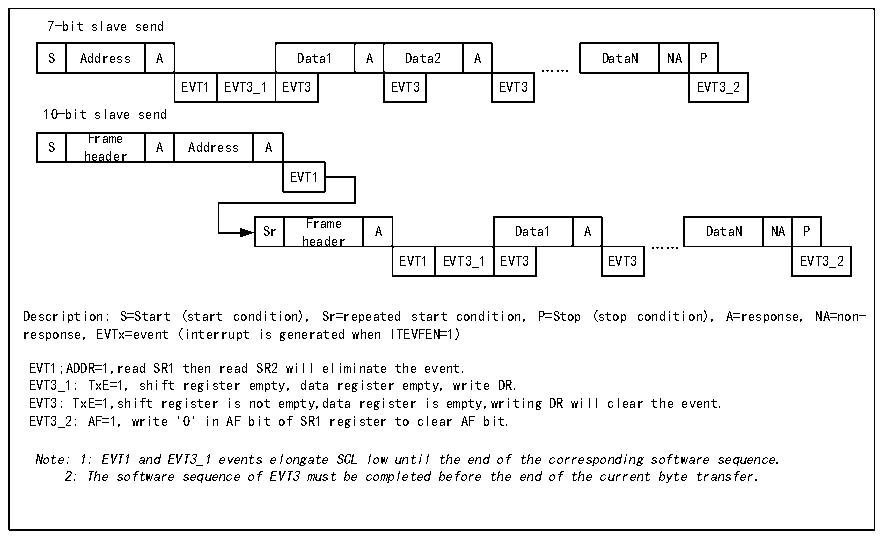
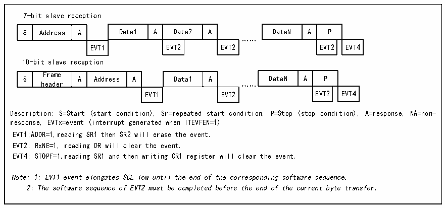

<!-- source-page: 186 -->

[← p.185](0185.md) · [index](../README.md) · [PDF p.186](https://ch32-riscv-ug.github.io/CH32X035/datasheet_en/CH32X035RM.PDF#page=186) · [p.187 →](0187.md)

<!-- header: CH32X035 Reference Manual https://wch-ic.com -->

Figure 15-5 Slave transmitter transmission sequence diagram  
 <!-- rendered from the PDF; verify at https://ch32-riscv-ug.github.io/CH32X035/datasheet_en/CH32X035RM.PDF#page=186 -->

🖼 Text parsed from the figure above

7-bit slave send  
S  Address  A  Data1  A  Data2  A  EVT1  EVT3_1  EVT3  EVT3  EVT3  
DataN  NA  P  EVT3_2  
……  
10-bit slave send  
S  Frame header  A  Address  A  EVT1  
Sr  Frame header  A  Data1  A  EVT1  EVT3_1  EVT3  EVT3  
DataN  NA  P  EVT3_2  
……  
Description: S=Start (start condition), Sr=repeated start condition, P=Stop (stop condition), A=response, NA=non-  
response, EVTx=event (interrupt is generated when ITEVFEN=1)  
EVT1;ADDR=1,read SR1 then read SR2 will eliminate the event.  
EVT3_1: TxE=1, shift register empty, data register empty, write DR.  
EVT3: TxE=1,shift register is not empty,data register is empty,writing DR will clear the event.  
EVT3_2: AF=1, write &#x27;0&#x27; in AF bit of SR1 register to clear AF bit.  
Note: 1: EVT1 and EVT3_1 events elongate SCL low until the end of the corresponding software sequence.  
2: The software sequence of EVT3 must be completed before the end of the current byte transfer.  

Slave receive mode:  
After ADDR is cleared, the I2C module stores the data on SDA into the data register via the shift register. After  
each byte is received, the I2C module sets an ACK bit and sets the RxNE bit, and generates an interrupt if  
ITEVTEN and ITBUFEN are set. If RxNE is set and the old data is not read before the new data is received, then  
BTF is set. SCL will remain low until the BTF bit is cleared. Reading status register 1 (R16_I2C1_STAR1) and  
reading the data in the data register will clear the BTF bit.  

Figure 15-6 Receiver transmission sequence diagram  
 <!-- rendered from the PDF; verify at https://ch32-riscv-ug.github.io/CH32X035/datasheet_en/CH32X035RM.PDF#page=186 -->

🖼 Text parsed from the figure above

7-bit slave reception  
S  Address  A  Data1  A  Data2  A  EVT1  EVT2  EVT2  
DataN  A  P  EVT2  EVT4  
……  
10-bit slave reception  
S  Frame header  A  Address  A  Data1  A  EVT1  EVT2  
DataN  A  P  EVT2  EVT4  
EVT1 EVT2 EVT2 EVT4  
Description: S=Start (start condition), Sr=repeated start condition, P=Stop (stop condition), A=response, NA=non-  
response, EVTx=event (interrupt generated when ITEVFEN=1)  
EVT1;ADDR=1,reading SR1 then SR2 will erase the event.  
EVT2: RxNE=1, reading DR will clear the event.  
EVT4: STOPF=1,reading SR1 and then writing CR1 register will clear the event.  
Note: 1: EVT1 event elongates SCL low until the end of the corresponding software sequence.  
2: The software sequence of EVT2 must be completed before the end of the current byte transfer.  

The master device will generate a stop condition after the last data byte is transferred. When the I2C module  
detects a stop event, it will set the STOPF bit, and if the ITEVFEN bit is set, it will also generate an interrupt. The  
user needs to read the status register (R16_I2C1_STAR1) and then write the control register (e.g. reset control  
word SWRST) to clear it.  
<!-- image: p186-draw-image-00001 bbox=[515.76, 783.48, 535.2, 793.8] -->
<!-- footer: V1.9 185 -->
