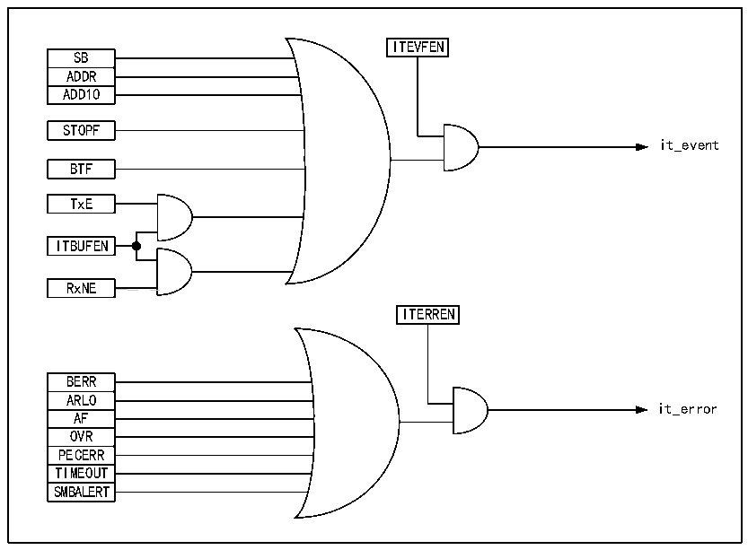

<!-- source-page: 188 -->

[← p.187](0187.md) · [index](../README.md) · [PDF p.188](https://ch32-riscv-ug.github.io/CH32X035/datasheet_en/CH32X035RM.PDF#page=188) · [p.189 →](0189.md)

<!-- header: CH32X035 Reference Manual https://wch-ic.com -->
It can be seen that enabling clock extension can avoid overrun/underrun errors.  

## 15.7 Interrupts

Each I2C module has 2 interrupt vectors, event interrupts and error interrupts. Both interrupts support the interrupt  
sources in Figure 15-7.  

Figure 15-7 I2C Interrupt Request  
 <!-- rendered from the PDF; verify at https://ch32-riscv-ug.github.io/CH32X035/datasheet_en/CH32X035RM.PDF#page=188 -->

🖼 Text parsed from the figure above

ITEVFEN  
SB  ADDR  ADD10  
STOPF  
it_event  
BTF  
TxE  
ITBUFEN  
RxNE  
<!-- image: p188-draw-image-00002 inside the figure -->
ITERREN  
BERR  ARLO  AF  OVR  PECERR  TIMEOUT  SMBALERT  
it_error  

## 15.8 Packet Error Checking

Packet Error Checksum (PEC) is an additional CRC8 checksum step to provide transmission reliability, calculated  
for each bit of serial data using the following polynomial.  
C=X8 +X2 +X+1  
The PEC calculation is activated by the ENPEC bit in the control register and is performed on all information  
bytes, including address and read/write bits. In transmitting, enabling PEC adds a byte of CRC8 calculation result  
after the last byte of data; while in receiving mode, in the last byte is considered as CRC8 check result, and if it  
does not match with the internal calculation result, it will reply a NAK, and in case of the main receiver,  
regardless of the correct check result.  

## 15.9 Register Description

<!-- p188-table-003 (table-15-1@1) pages 188-189 -->
<table><caption>Table 15-1 I2C-related registers list</caption><tr><th>Name</th><th>Access address</th><th>Description</th><th>Reset value</th></tr><tr><td>R16_I2C1_CTLR1</td><td>0x40005400</td><td>I2C control register 1</td><td>0x0000</td></tr><tr><td>R16_I2C1_CTLR2</td><td>0x40005404</td><td>I2C control register 2</td><td>0x0000</td></tr><tr><td>R16_I2C1_OADDR1</td><td>0x40005408</td><td>I2C address register 1</td><td>0x0000</td></tr><tr><td>R16_I2C1_OADDR2</td><td>0x4000540C</td><td>I2C address register 2</td><td>0x0000</td></tr><tr><td>R16_I2C1_DATAR</td><td>0x40005410</td><td>I2C data register</td><td>0x0000</td></tr><tr><td>R16_I2C1_STAR1</td><td>0x40005414</td><td>I2C status register 1</td><td>0x0000</td></tr><tr><td>R16_I2C1_STAR2</td><td>0x40005418</td><td>I2C status register 2</td><td>0x0000</td></tr><tr><td>R16_I2C1_CKCFGR</td><td>0x4000541C</td><td>I2C clock register</td><td>0x0000</td></tr></table>

<!-- image: p188-draw-image-00001 bbox=[515.76, 783.48, 535.2, 793.8] -->
<!-- footer: V1.9 187 -->
