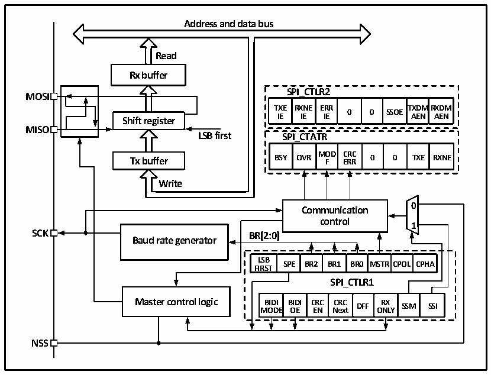

<!-- source-page: 196 -->

[← p.195](0195.md) · [index](../README.md) · [PDF p.196](https://ch32-riscv-ug.github.io/CH32X035/datasheet_en/CH32X035RM.PDF#page=196) · [p.197 →](0197.md)

<!-- header: CH32X035 Reference Manual https://wch-ic.com -->

# Chapter 16 Serial Peripheral Interface (SPI)

SPI supports data interaction in a 3-wire synchronous serial mode, plus a chip selector line to support hardware  
switching between Master and Slave modes, and supports communication on a single data line.  

## 16.1 Main Features

● Support full-duplex synchronous serial mode  
● Support single-line half-duplex mode  
● Support Master mode and Slave mode, multi-slave mode  
● Support 8-bit or 16-bit data structures  
● Maximum clock frequency supports up to half of FHCLK  
● Data order supports MSB or LSB first  
● Support hardware or software control of NSS pins  
● Hardware CRC checksum support for transmitting and receiving  
● Transceiver buffers support DMA transfers  
● Support modification of clock phase and polarity  

## 16.2 Function Description

### 16.2.1 Overview

Figure 16-1 SPI structure block diagram  
 <!-- rendered from the PDF; verify at https://ch32-riscv-ug.github.io/CH32X035/datasheet_en/CH32X035RM.PDF#page=196 -->

🖼 Text parsed from the figure above

<strong>Address and data bus</strong>  
<!-- image: p196-draw-image-00004 inside the figure -->
<strong>Read</strong>  
<strong>Rx buffer</strong>  
<strong>SPI_CTLR2</strong>  
<strong>MOSI</strong>  
<strong>TXE RXNE ERR TXDMRXDM</strong>  
<strong>0 0 SSOE</strong>  
<strong>IE IE IE AEN AEN</strong>  
<strong>Shift register</strong>  
<strong>MISO</strong>  
<strong>LSB first SPI_CTATR</strong>  
<strong>MOD CRC</strong>  
<strong>Tx buffer BSY OVR F ERR 0 0 TXE RXNE</strong>  
<strong>Write</strong>  
<!-- image: p196-draw-image-00002 inside the figure -->
<!-- image: p196-draw-image-00003 inside the figure -->
<strong>0</strong>  
<strong>Communication</strong>  
<strong>control</strong>  
<strong>1</strong>  
<strong>SCK BR[2:0]</strong>  
<strong>Baud rate generator</strong>  
BR[2:0]  LSBFIRST  SPE  BR2  BR1  BR0  MSTR  RCPOL  CPHA  
<strong>SPI_CTLR1</strong>  
BIDIMODE  BIDIOE  CRCEN  CRCNext  DFF  RXON  SSMLY  SSI  
<strong>NSS</strong>  

<!-- image: p196-draw-image-00001 bbox=[515.76, 783.48, 535.2, 793.8] -->
<!-- footer: V1.9 195 -->
