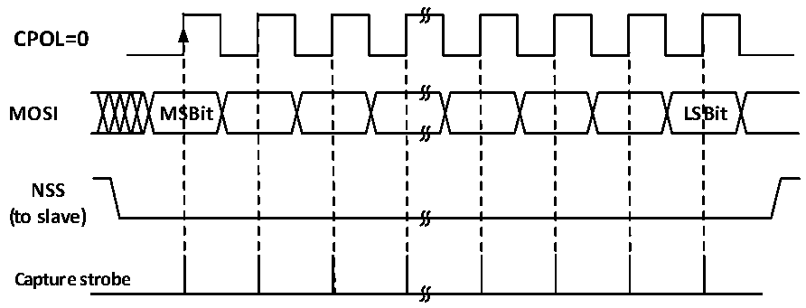
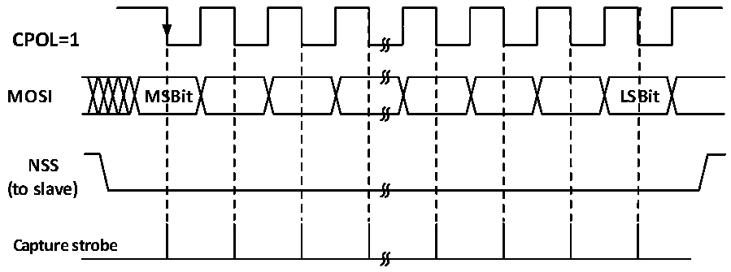

<!-- source-page: 200 -->

[← p.199](0199.md) · [index](../README.md) · [PDF p.200](https://ch32-riscv-ug.github.io/CH32X035/datasheet_en/CH32X035RM.PDF#page=200) · [p.201 →](0201.md)

<!-- header: CH32X035 Reference Manual https://wch-ic.com -->
The NSS pin needs to be held low in hardware management mode, if NSS is set to software management (SSM  
set), then keep SSI unset.  
Clear the MSTR bit and set the SPE bit to enable SPI mode.  
During transmission, when the first slave receive sample edge appears in SCK, the slave starts to transmit. The  
process of transmitting is to move the data in the transmit buffer t the transmit shift register. When the data in the  
transmit buffer is moved to the shift register, the TXE flag will be set, and if the TXEIE bit was set before, then an  
interrupt will be generated.  
During reception, after the last clock sample edge, the RXNE bit is set, the bytes received by the shift register are  
transferred to the receive buffer, and the read operation of the read data register can obtain the data in the receive  
buffer. If RXNEIE is set before RXNE is set, then an interrupt is generated.  

Figure 16-6 SPI slave mode read mode 0  
 <!-- rendered from the PDF; verify at https://ch32-riscv-ug.github.io/CH32X035/datasheet_en/CH32X035RM.PDF#page=200 -->

# MODE 0

# CPHA=0

🖼 Text parsed from the figure above

<strong>CPOL=0</strong>  
<strong>MOSI MSBit LSBit</strong>  
<strong>NSS</strong>  
<strong>(to slave)</strong>  
<strong>Capture strobe</strong>  

Figure 16-7 SPI slave mode read mode 1  
 <!-- rendered from the PDF; verify at https://ch32-riscv-ug.github.io/CH32X035/datasheet_en/CH32X035RM.PDF#page=200 -->

# MODE 1

# CPHA=0

🖼 Text parsed from the figure above

<strong>CPOL=1</strong>  
<strong>MOSI MSBit LSBit</strong>  
<strong>NSS</strong>  
<strong>(to slave)</strong>  
<strong>Capture strobe</strong>  

<!-- image: p200-draw-image-00001 bbox=[515.76, 783.48, 535.2, 793.8] -->
<!-- footer: V1.9 199 -->
