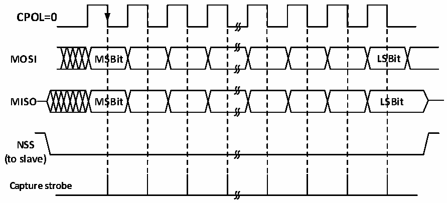
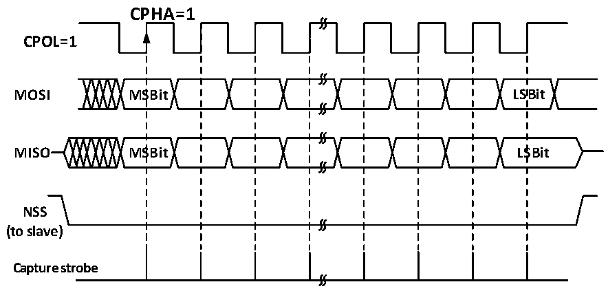

<!-- source-page: 201 -->

[← p.200](0200.md) · [index](../README.md) · [PDF p.201](https://ch32-riscv-ug.github.io/CH32X035/datasheet_en/CH32X035RM.PDF#page=201) · [p.202 →](0202.md)

<!-- header: CH32X035 Reference Manual https://wch-ic.com -->

Figure 16-8 SPI slave mode read/write mode 2  
 <!-- rendered from the PDF; verify at https://ch32-riscv-ug.github.io/CH32X035/datasheet_en/CH32X035RM.PDF#page=201 -->

# MODE 2

# CPHA=1

🖼 Text parsed from the figure above

<strong>CPOL=0</strong>  
<strong>MOSI MSBit LSBit</strong>  
<strong>MISO MSBit LSBit</strong>  
<strong>NSS</strong>  
<strong>(to slave)</strong>  
<strong>Capture strobe</strong>  

Figure 16-9 SPI slave mode read/write mode 3  
 <!-- rendered from the PDF; verify at https://ch32-riscv-ug.github.io/CH32X035/datasheet_en/CH32X035RM.PDF#page=201 -->

# MODE 3

🖼 Text parsed from the figure above

CPHA=1  
<strong>CPOL=1</strong>  
<strong>MOSI MSBit LSBit</strong>  
<strong>MISO MSBit LSBit</strong>  
<strong>NSS</strong>  
<strong>(to slave)</strong>  
<strong>Capture strobe</strong>  

### 16.2.4 Simplex Mode

The SPI interface can operate in half-duplex mode, where the master device uses the MOSI pin and the slave  
device uses the MISO pin for communication. When using half-duplex communication, you need to set  
BIDIMODE and use BIDIOE to control the transmission direction.  
Setting the RXONLY bit in normal full-duplex mode sets the SPI module to receive-only simplex mode, releasing  
a data pin after RXONLY is set. The SPI can also be set to transmit only mode by ignoring the received data.  

### 16.2.5 CRC

The SPI module uses CRC checksum to ensure the reliability of full-duplex communication, and separate CRC  
calculators are used for data transmitting and receiving. the polynomial for CRC calculation is determined by the  
<!-- image: p201-draw-image-00001 bbox=[515.76, 783.48, 535.2, 793.8] -->
<!-- footer: V1.9 200 -->
