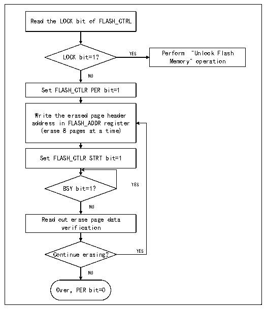

<!-- source-page: 245 -->

[← p.244](0244.md) · [index](../README.md) · [PDF p.245](https://ch32-riscv-ug.github.io/CH32X035/datasheet_en/CH32X035RM.PDF#page=245) · [p.246 →](0246.md)

<!-- header: CH32X035 Reference Manual https://wch-ic.com -->

Figure 20-1 FLASH page erase  
 <!-- rendered from the PDF; verify at https://ch32-riscv-ug.github.io/CH32X035/datasheet_en/CH32X035RM.PDF#page=245 -->

🖼 Text parsed from the figure above

Read the LOCK bit of FLASH_CTRL  
LOCK bit=1? YES Perform &quot;Unlock Flash  
Memory&quot; operation  
NO  
Set FLASH_CTLR PER bit=1  
Write the erased page header  
address in FLASH_ADDR register  
(erase 8 pages at a time)  
Set FLASH_CTLR STRT bit=1  
BSY bit=1？ YES  
NO  
Read out erase page data  
verification  
Continue erasing? YES  
NO  
Over，PER bit=0  

1) Check the LOCK bit of FLASH_CTLR register, if it is 1, you need to perform the &quot;Unlock Flash&quot; operation.  
2) Set the PER bit of FLASH_CTLR register to &#x27;1&#x27; to enable the sectors erase mode.  
3) Write the page header address to the FLASH_ADDR register to select the page to be erased.  
4) Set the STRT bit of FLASH_CTLR register to &#x27;1&#x27; to initiate an erase action.  
5) Wait for the BSY bit to become &#x27;0&#x27; or the EOP bit of FLASH_STATR register to become &#x27;1&#x27; to indicate the end  
of erasure, and clear the EOP bit to 0.  
6) Read the data of the erased page for verification.  
7) Continue the sectors erase can repeat steps 3-5, end the erase to clear the PER bit to 0.  
<em>Note: After successful erasure, the word reads - 0xFF.</em>  
<!-- image: p245-draw-image-00001 bbox=[515.76, 783.48, 535.2, 793.8] -->
<!-- footer: V1.9 244 -->
