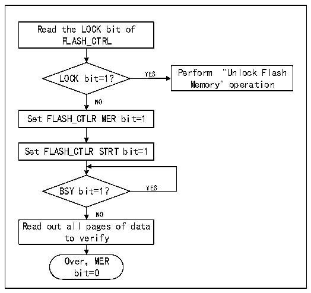

<!-- source-page: 246 -->

[← p.245](0245.md) · [index](../README.md) · [PDF p.246](https://ch32-riscv-ug.github.io/CH32X035/datasheet_en/CH32X035RM.PDF#page=246) · [p.247 →](0247.md)

<!-- header: CH32X035 Reference Manual https://wch-ic.com -->

Figure 20-2 FLASH whole chip erase  
 <!-- rendered from the PDF; verify at https://ch32-riscv-ug.github.io/CH32X035/datasheet_en/CH32X035RM.PDF#page=246 -->

🖼 Text parsed from the figure above

Read the LOCK bit of  
FLASH_CTRL  
LOCK bit=1? YES Perform &quot;Unlock Flash  
Memory&quot; operation  
NO  
Set FLASH_CTLR MER bit=1  
Set FLASH_CTLR STRT bit=1  
BSY bit=1？ YES  
NO  
Read out all pages of data  
to verify  
Over，MER  
bit=0  

1) Check the LOCK bit of FLASH_CTLR register, if it is 1, you need to perform the &quot;unlock flash memory&quot;  
operation.  
2) Set the MER bit of FLASH_CTLR register to &#x27;1&#x27; to enable the whole chip erase mode.  
3) Set the STRT bit of FLASH_CTLR register to &#x27;1&#x27; to start the erase operation.  
4) Wait for the BSY bit to become &#x27;0&#x27; or the EOP bit of FLASH_STATR register to be &#x27;1&#x27; to indicate the end of  
erasure, and clear the EOP bit to 0.  
5) Read the data of the erased page for verification.  
6) Clear the MER bit to 0.  

### 20.4.4 Fast Programming Mode Unlock

Fast programming mode operation can be unlocked by writing a sequence to the FLASH_MODEKEYR register.  
After unlocking, the FLOCK bit in the FLASH_CTLR register will clear to 0, indicating that fast erase and  
programming operations can be performed. The FLASH_CTLR register can be locked again by software setting  
the &quot;FLOCK&quot; bit to 1.  
Unlock sequence:  
1) Write KEY1 = 0x45670123 to the FLASH_MODEKEYR register;  
2) Write KEY2 = 0xCDEF89AB to the FLASH_MODEKEYR register.  
The above operations must be performed sequentially and consecutively, otherwise they will be locked as errors  
and cannot be unlocked until the next system reset.  
<em>Note: The fast programming operation needs to unlock the &quot;LOCK&quot; and &quot;FLOCK&quot; layers.</em>  

### 20.4.5 Main Memory Fast Programming

Fast programming is done on a page-by-page basis (256 bytes).  
1) Check the FLASH_CTLR register LOCK bit, if it is &#x27;1&#x27;, you need to perform the &quot;Unlock Flash Memory&quot;  
operation.  
2) Check the FLASH_CTLR register FLOCK bit, if it is &#x27;1&#x27;, you need to perform the &quot;Fast Programming Mode  
Unlock&quot; operation.  
3) Check the BSY bit of the FLASH_STATR register to make sure there is no other programming operation in  
<!-- image: p246-draw-image-00001 bbox=[515.76, 783.48, 535.2, 793.8] -->
<!-- footer: V1.9 245 -->
