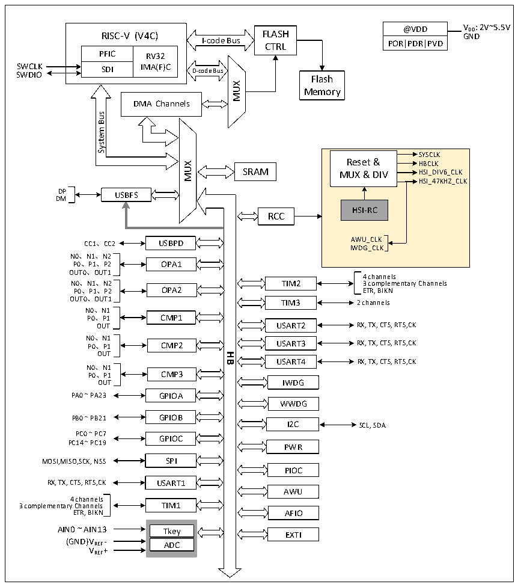

<!-- source-page: 3 -->

[← p.2](0002.md) · [index](../README.md) · [PDF p.3](https://ch32-riscv-ug.github.io/CH32X035/datasheet_zh/CH32X035RM.PDF#page=3) · [p.4 →](0004.md)

<!-- header: CH32X035系列应用手册 https://wch.cn -->

# 第 1 章 存储器和总线架构

## 1.1 总线架构

微控制器基于RISC-V指令集设计，其架构中将青稞微处理器内核、仲裁单元、DMA模块、SRAM  
存储等部件通过多组总线实现交互。其系统框图见图1-1。  

图1-1 CH32X035系统框图  
 <!-- rendered from the PDF; verify at https://ch32-riscv-ug.github.io/CH32X035/datasheet_zh/CH32X035RM.PDF#page=3 -->

🖼 Text parsed from the figure above

@VDD V DD : 2V~5.5V GND  
RISC-V (V4C) FLASH  
RISC-V (V4C)  PFIC  RV32IMA(F)C  SDI  
I-code Bus CTRL  
POR|PDR|PVD  
SWCLK SWDIO  
Flash  
MUX  
Memory  
DMA Channels  
Bus  
<!-- image: p3-draw-image-00002 inside the figure -->
System  
SYSCLK  
Reset &amp; HBCLK  
MUX  
SRAM  
MUX &amp; DIV HSI_DIV6_CLK  
HSI_47KHZ_CLK  
DP  
USBFS  
DM  
HSI-RC  
RCC  
CC1、CC2 AWU_CLK  
USBPD  
IWDG_CLK  
N0、N1、N2  
P0、P1、P2 OPA1  
OUT0、OUT1  
4 channels  
N0、N1、N2  
TIM2 3 complementary Channels  
P0、P1、P2 OPA2  
ETR, BIKN  
OUT0、OUT1  
TIM3 2 channels  
N0、N1  
P0、P1 CMP1  
USART2 RX, TX, CTS, RTS,CK  
OUT  
N0、N1  
USART3 RX, TX, CTS, RTS,CK  
P0、P1 CMP2  
OUT  
<strong>HB</strong>  
USART4  
RX, TX, CTS, RTS,CK  
N0、N1  
P0、P1 CMP3  
IWDG  
OUT  
PA0 ~ PA23 GPIOA  
WWDG  
GPIOB  
PB0 ~ PB21  
I2C SCL, SDA  
PC0 ~ PC7  
GPIOC  
PC14 ~ PC19  
PWR  
MOSI,MISO,SCK, NSS SPI  
PIOC  
RX, TX, CTS, RTS,CK USART1  
AWU  
4 channels  
3 complementary Channels TIM1  
AFIO  
ETR, BIKN  
AIN0 ~ AIN13 Tkey  
EXTI  
(GND)V REF - ADC  
VREF+  

系统中设有：通用DMA控制器用以减轻CPU负担、提高效率；时钟树分级管理用以降低了外设  
总的运行功耗，同时还兼有数据保护机制，时钟安全系统保护机制等措施来增加系统稳定性。  
● 指令总线(I-Code)将内核和FLASH指令接口相连，预取指在此总线上完成。  
● 数据总线(D-Code)将内核和FLASH数据接口相连，用于常量加载和调试。  
● 系统总线将内核和总线矩阵相连，用于协调内核、DMA、SRAM和外设的访问。  
● DMA总线负责DMA的HB主控接口与总线矩阵相连，该总线访问对象是FLASH数据、SRAM和外设。  
● 总线矩阵负责的是系统总线、数据总线、DMA总线、SRAM和HB桥之间的访问协调。  
<!-- image: p3-draw-image-00001 bbox=[507.84, 786.12, 527.28, 796.68] -->
<!-- footer: V1.9 3 -->
