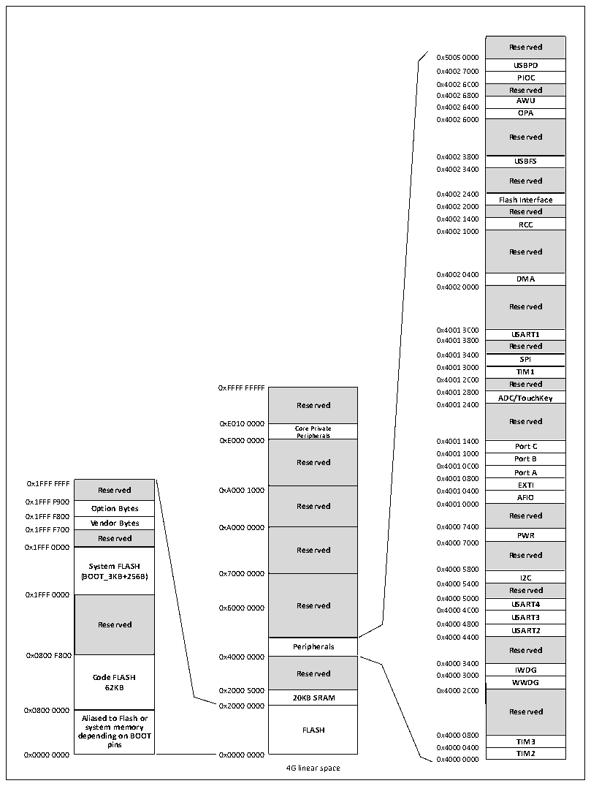

<!-- source-page: 4 -->

[← p.3](0003.md) · [index](../README.md) · [PDF p.4](https://ch32-riscv-ug.github.io/CH32X035/datasheet_zh/CH32X035RM.PDF#page=4) · [p.5 →](0005.md)

<!-- header: CH32X035系列应用手册 https://wch.cn -->

## 1.2 存储器映像

CH32X035产品包含了程序存储器、数据存储器、内核寄存器和外设寄存器等等，它们都在一个  
4GB的线性空间寻址。  
系统存储以小端格式存放数据，即低字节存放在低地址，高字节存放在高地址。  

图1-2 存储映像  
 <!-- rendered from the PDF; verify at https://ch32-riscv-ug.github.io/CH32X035/datasheet_zh/CH32X035RM.PDF#page=4 -->

🖼 Text parsed from the figure above

Reserved  USBPD  PIOC  Reserved  AWU  OPA  Reserved  USBFS  Reserved  Flash Interface  Reserved  RCC  Reserved  DMA  Reserved  USART1  Reserved  SPI  TIM1  Reserved  Reserved ADC/TouchKey  Reserved  Port C  Port B  Port A  EXTI  EXTIAFIO  AFIOReserved  PWR  Reserved  I2C  Reserved  USART4  USART3  USART2  Reserved  IWDG  WWDG  Reserved  TIM3  TIM2  
0x5005 0000  
0x4002 7000  
0x4002 6C00  
0x4002 6800  
0x4002 6400  
0x4002 6000  
0x4002 3400  
0x4002 2400  
0x4002 2000  
0x4002 1400  
0x4002 1000  
0x4002 0000  
0x4001 3800  
0x4001 3400 SPI  
0xFFFF FFFFF 0 0 x x 4 4 0 0 0 0 1 1 2 28 C 0 0 0 0 Reserved  
Reserved  Core Private Peripherals  Peripherals Reserved  Reserved  Reserved  Reserved  Peripherals  Reserved  20KB SRAM  FLASH  
Reserved 0x4001 2400  
<strong>0xE010 0000 Reserved</strong>  
0xE000 0000 Peripherals 0x4001 1400 Port C  
<strong>Reserved 0 0 x x 4 4 0 0 0 0 1 1 0 10 C 0 0 0 0 Port B</strong>  
0x4001 0800  
Reserved  Option Bytes  Vendor Bytes  Vendor Bytes Reserved  System FLASH (BOOT_3KB+256B)  Reserved  Code FLASH62KB  Aliased to Flash or system memory depending on BOOT pins  
0x1FFF F700 Vendor Bytes 0xA000 0000 0x4000 7400  
0x4000 5400  
0x6000 0000 Reserved 0x4000 4C00 USART4  
0x4000 4400  
<strong>Peripherals Reserved</strong>  
0x4000 3400  
0x2000 0000  
<strong>system memory FLASH</strong>  
0x0000 0000 0x0000 0000 TIM2  
0x4000 0000  
4G linear space  

### 1.2.1 存储器分配

内置20K字节的SRAM，起始地址0x20000000，支持字节、半字(2字节)、全字(4字节)访问。  
内置最大62K字节的程序闪存存储区(CodeFlash)，用于存储用户应用程序。  
内置3328字节的系统存储器(bootloader)，用于存储系统引导程序（厂家固化自举加载程序）。  
该区域可通过WCH-LinkUtility工具与上述62K字节区域一起用于用户区。具体可参考相关EVT。  
内置256字节空间用于厂商配置字存储，出厂前固化，用户不可修改。  
内置256字节空间用于用户选择字存储。  
<!-- image: p4-draw-image-00001 bbox=[507.84, 786.12, 527.28, 796.68] -->
<!-- footer: V1.9 4 -->
