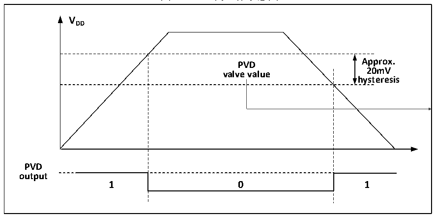

<!-- source-page: 6 -->

[← p.5](0005.md) · [index](../README.md) · [PDF p.6](https://ch32-riscv-ug.github.io/CH32X035/datasheet_zh/CH32X035RM.PDF#page=6) · [p.7 →](0007.md)

<!-- header: CH32X035系列应用手册 https://wch.cn -->
1） 设置PWR_CTLR寄存器的PLS[1:0]域，选择要监控电压阈值。  
2） 可选的中断处理。PVD功能内部连接EXTI模块的第26线的上升/下降边沿触发设置，开启此中  
断（配置EXTI），当VDD 下降到PVD阈值以下或上升到PVD阈值之上时就会产生PVD中断。  
3） 读取PWR_CSR状态寄存器的PVD0位可获取当前系统主电源与PLS[1:0]设置阈值关系，执行相应  
软处理。当VDD电压高于PLS[1:0]设置阈值，PVD0位置0；当VDD电压低于PLS[1:0]设置阈值，  
PVD0位置1。  

图2-3 PVD的工作示意图  
 <!-- rendered from the PDF; verify at https://ch32-riscv-ug.github.io/CH32X035/datasheet_zh/CH32X035RM.PDF#page=6 -->

🖼 Text parsed from the figure above

<strong>VDD</strong>  
PVD valve value  0  
<strong>Approx.</strong>  
<strong>20mV</strong>  
<strong>hysteresis</strong>  
<strong>PVD</strong>  
<strong>output</strong>  

## 2.3 低功耗模式

在系统复位后，微控制器处于正常工作状态（运行模式），此时可以通过降低系统主频或者关  
闭不用外设的时钟或者降低工作外设时钟频率来节省系统功耗。如果系统不需要工作，可设置系统  
进入低功耗模式，并通过特定事件让系统跳出此状态。  
微控制器目前提供了3种低功耗模式，从处理器、外设、电压调节器等的工作差异上分为：  
● 睡眠模式：内核停止运行，所有外设（包含内核私有外设）仍在运行。  
● 停止模式：停止所有时钟，唤醒后系统继续运行。  
● 待机模式：停止所有时钟，唤醒后系统继续运行。  

<!-- p6-table-002 (table-2-1@1) -->
<table><caption>表2-1 低功耗模式一览</caption><tr><th>模式</th><th>进入</th><th>唤醒源</th><th>对时钟的影响</th><th>电压调节器</th></tr><tr><td rowspan="2" style="text-align:left">睡眠 sleep</td><td>WFI</td><td>任意中断唤醒</td><td rowspan="2" style="text-align:left">内核时钟关闭， 其他时钟无影响</td><td rowspan="2">正常模式</td></tr><tr><td>WFE</td><td>唤醒事件唤醒</td></tr><tr><td style="text-align:left">停止 stop</td><td style="text-align:left">SLEEPDEEP置1PDDS清0WFI或WFE</td><td style="text-align:left">任意外部中断/事件（EXTI 信 号）、RST 上的外部复位信号、 IWDG复位1</td><td style="text-align:left">关闭HSI、 关闭外设时钟</td><td>正常模式</td></tr><tr><td style="text-align:left">待机 standby</td><td style="text-align:left">SLEEPDEEP置1PDDS置1WFI或WFE</td><td style="text-align:left">任意外部中断/事件（EXTI 信 号）、RST 上的外部复位信号、 IWDG复位1</td><td style="text-align:left">关闭HSI、 关闭外设时钟</td><td>低功耗模式</td></tr></table>

注：SLEEPDEEP位属于内核私有外设控制位，参考PFIC_SCTLR寄存器。  
（1）使用IWDG复位功能，HSI不可被关闭。  

### 2.3.1 低功耗配置选项

● WFI和WFE方式  
WFI：微控制器被具有中断控制器响应的中断源唤醒，系统唤醒后，将最先执行中断服务函数（微  
控制器复位除外）。  
<!-- image: p6-draw-image-00001 bbox=[507.84, 786.12, 527.28, 796.68] -->
<!-- footer: V1.9 6 -->
