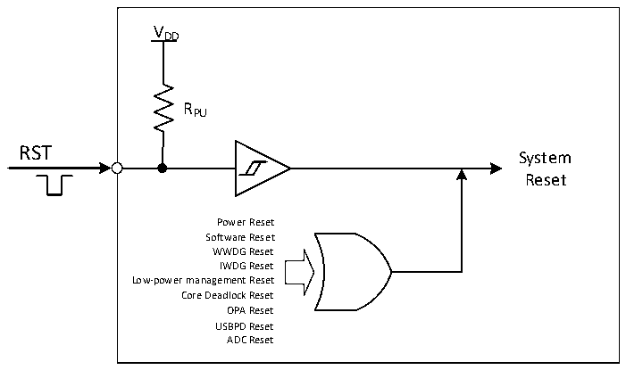

<!-- source-page: 11 -->

[← p.10](0010.md) · [index](../README.md) · [PDF p.11](https://ch32-riscv-ug.github.io/CH32X035/datasheet_zh/CH32X035RM.PDF#page=11) · [p.12 →](0012.md)

<!-- header: CH32X035系列应用手册 https://wch.cn -->
USBPD复位：当PD_RST_EN为1时，CH32X035支持USB PD信号帧Hard Reset产生的复位；如  
果IE_RX_RESET也为1，则还支持信号帧Cable Reset产生的复位。USB PD没有复位标志，但产生  
的复位效果同软件复位。  
ADC 复位：在 ADC 看门狗复位使能开启的情况下，当 ADC 数据大于看门狗高阈值或者小于看门  
狗低阈值时会产生ADC复位。  

图3-1系统复位结构  
 <!-- rendered from the PDF; verify at https://ch32-riscv-ug.github.io/CH32X035/datasheet_zh/CH32X035RM.PDF#page=11 -->

🖼 Text parsed from the figure above

VDD  
RPU  
RST  
System  
Reset  
Power Reset  
Software Reset  
WWDG Reset  
IWDG Reset  
Low-power management Reset  
Core Deadlock Reset  
OPA Reset  
USBPD Reset  
ADC Reset  

<!-- image: p11-draw-image-00001 bbox=[507.84, 786.12, 527.28, 796.68] -->
<!-- footer: V1.9 11 -->
