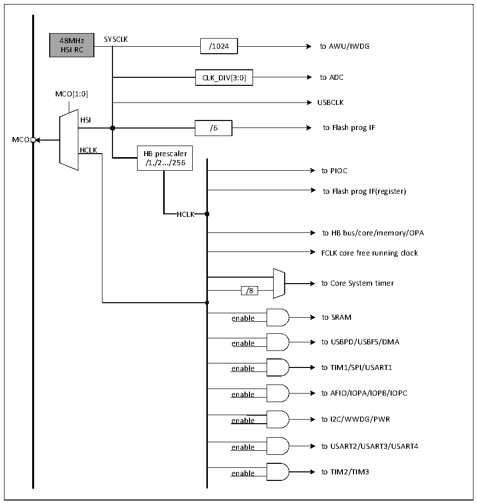

<!-- source-page: 12 -->

[← p.11](0011.md) · [index](../README.md) · [PDF p.12](https://ch32-riscv-ug.github.io/CH32X035/datasheet_zh/CH32X035RM.PDF#page=12) · [p.13 →](0013.md)

<!-- header: CH32X035系列应用手册 https://wch.cn -->

## 3.3 时钟

### 3.3.1 系统时钟结构

图3-2 CH32X035时钟树框图  
 <!-- rendered from the PDF; verify at https://ch32-riscv-ug.github.io/CH32X035/datasheet_zh/CH32X035RM.PDF#page=12 -->

🖼 Text parsed from the figure above

48MHz SYSCLK  
/1024 to AWU/IWDG  
HSI RC  
CLK_DIV[3:0] to ADC  
MCO[1:0]  
USBCLK  
HSI  
/6 to Flash prog IF  
MCO  
HCLK  
HB prescaler  
/1,/2.../256  
to PIOC  
to Flash prog IF(register)  
HCLK  HCLK  
to HB bus/core/memory/OPA  
FCLK core free running clock  
to Core System timer  
/8  /8  
enable to SRAM  
enable to USBPD/USBFS/DMA  
enable to TIM1/SPI/USART1  
enable to AFIO/IOPA/IOPB/IOPC  
enable to I2C/WWDG/PWR  
enable to USART2/USART3/USART4  
enable to TIM2/TIM3  

<!-- image: p12-draw-image-00001 bbox=[507.84, 786.12, 527.28, 796.68] -->
<!-- footer: V1.9 12 -->
