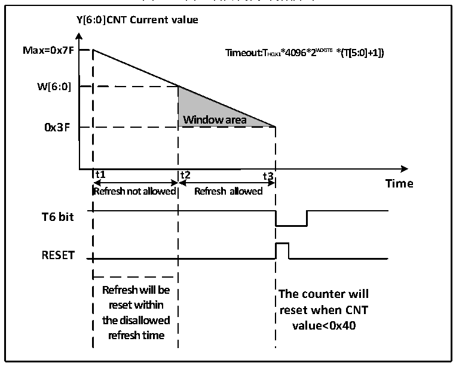

<!-- source-page: 27 -->

[← p.26](0026.md) · [index](../README.md) · [PDF p.27](https://ch32-riscv-ug.github.io/CH32X035/datasheet_zh/CH32X035RM.PDF#page=27) · [p.28 →](0028.md)

<!-- header: CH32X035系列应用手册 https://wch.cn -->
4） 喂狗：即刷新当前计数器值，配置WWDG_CTLR寄存器的T[6:0]位域。此动作需要在看门狗功能  
开启后，在周期性的窗口时间内执行，否则会出现看门狗复位动作。  
● 喂狗窗口时间  
如图6-2所示，灰色区域为窗口看门狗的监测窗口区域，其上限时间t2对应当前计数器值达到  
窗口值 W[6:0]的时间点；其下限时间 t3 对应当前计数器值达到 0x3F 的时间点。此区域时间内  
t2&lt;t&lt;t3可以进行喂狗操作（写T[6:0]），刷新当前计数器的数值。  

图6-2 窗口看门狗的计数模式  
 <!-- rendered from the PDF; verify at https://ch32-riscv-ug.github.io/CH32X035/datasheet_zh/CH32X035RM.PDF#page=27 -->

🖼 Text parsed from the figure above

<strong>Y[6:0]CNT Current value</strong>  
<strong>Max=0x7F Timeout:THCLK1*4096*2W D G T B *(T[5:0]+1])</strong>  
<strong>W[6:0]</strong>  
<strong>Window area</strong>  
<strong>0x3F</strong>  
<strong>t1 t2 t3</strong>  
<strong>Time</strong>  
<strong>Refresh not allowed Refresh allowed</strong>  
<strong>T6 bit</strong>  
<strong>RESET</strong>  
<strong>Refresh will be</strong>  
<strong>The counter will</strong>  
<strong>reset within</strong>  
<strong>reset when CNT</strong>  
<strong>the disallowed</strong>  
<strong>value&lt;0x40</strong>  
<strong>refresh time</strong>  

● 看门狗复位  
1） 当没有及时喂狗操作，导致T[6:0]计数器的值由0x40变成0x3F，将出现“窗口看门狗复位”，  
产生系统复位。即T6-bit被硬件检测为0，将出现系统复位。  
注：应用程序可以通过软件写T6-bit为0，实现系统复位，等效软件复位功能。  
2） 当在不允许喂狗时间内执行计数器刷新动作，即在t1≤t≤t2时间内操作写T[6:0]位域，将出  
现“窗口看门狗复位”，产生系统复位。  
● 提前唤醒  
为了防止没有及时刷新计数器导致系统复位，看门狗模块提供了早期唤醒中断（EWI）通知。当  
计数器自减到0x40时，产生提前唤醒信号，WEIF标志置1，如果置位了EWI位，会同时触发窗口看  
门狗中断。此时距离硬件复位有1个计数器时钟周期（自减为0x3F），应用程序可在此时间内即时  
进行喂狗操作。  

### 6.2.2 调试模式

系统进入调试模式时，可以由调试模块寄存器配置WWDG的计数器继续工作或停止。  
<!-- image: p27-draw-image-00001 bbox=[507.84, 786.12, 527.28, 796.68] -->
<!-- footer: V1.9 27 -->
