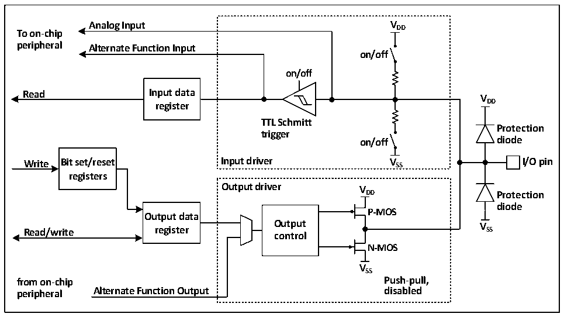

<!-- source-page: 57 -->

[← p.56](0056.md) · [index](../README.md) · [PDF p.57](https://ch32-riscv-ug.github.io/CH32X035/datasheet_zh/CH32X035RM.PDF#page=57) · [p.58 →](0058.md)

<!-- header: CH32X035系列应用手册 https://wch.cn -->

# 第 8 章 GPIO 及其复用功能（GPIO/AFIO）

GPIO 口可以配置成多种输入或输出模式，内置可关闭的上拉电阻，部分 GPIO 内置可关闭的下  
拉电阻，可以配置成推挽功能。GPIO口还可以复用成其他功能。  
PA0-PA7、PB0-PB1、PC0-PC3支持ADC模拟信号输入通道0～13。  
所有GPIO引脚都支持可控上拉，仅PA0-PA15和PC16-PC17支持可控下拉，其余引脚不支持下  
拉。PC14-PC17支持多种上拉模式，分别由PD和USB引脚相对应的专用控制寄存器设置。  

## 8.1 主要特征

端口的每个引脚可以配置成以下的多种模式之一：  
● 浮空输入 ● 模拟输入  
● 上拉输入 ● 推挽输出  
● 下拉输入（部分IO） ● 复用功能的输入和输出  
许多引脚拥有复用功能，很多其他的外设把自己的输出和输入通道映射到这些引脚上，这些复  
用引脚具体用法需要参照各个外设，而对这些引脚是否复用和是否重映射的内容由本章说明。  

## 8.2 功能描述

### 8.2.1 概述

图8-1 GPIO模块基本结构框图  
 <!-- rendered from the PDF; verify at https://ch32-riscv-ug.github.io/CH32X035/datasheet_zh/CH32X035RM.PDF#page=57 -->

🖼 Text parsed from the figure above

<strong>Analog Input VDD</strong>  
<strong>To on-chip</strong>  
<strong>peripheral Alternate Function Input</strong>  
<strong>on/off</strong>  
<strong>on/off</strong>  
<strong>Read Input data</strong>  
<strong>V</strong>  
<strong>register DD</strong>  
<strong>TTL Schmitt</strong>  
<strong>Protection</strong>  
<strong>trigger</strong>  
<strong>on/off diode</strong>  
<strong>Write Bit set/reset Input driver V SS I/O pin</strong>  
<strong>registers</strong>  
<strong>Output driver V</strong>  
<strong>DD Protection</strong>  
<strong>diode</strong>  
<strong>P-MOS</strong>  
<strong>Output data</strong>  
<strong>Read/write register O co u n t t p r u o t l V SS</strong>  
<strong>N-MOS</strong>  
<strong>VSS</strong>  
<strong>from on-chip Push-pull,</strong>  
<strong>peripheral Alternate Function Output disabled</strong>  

如图 8-1所示 IO 口结构，每个引脚在芯片内部都有两只保护二极管，IO 口内部可分为输入和  
输出驱动模块。其中输入驱动有上拉电阻和下拉电阻（仅部分 IO）可选，可连接到 AD 等模拟输入  
的外设；如果输入到数字外设，就需要经过一个TTL施密特触发器，再连接到GPIO输入寄存器或其  
他复用外设。而输出驱动有一对MOS管，可将IO口配置成推挽输出；输出驱动内部也可以配置成由  
GPIO控制输出还是由复用的其他外设控制输出。  

### 8.2.2 GPIO的初始化功能

刚复位后，GPIO 口运行在初始状态，这时大多数 IO 口都是运行在浮空输入状态，但也有外设  
<!-- image: p57-draw-image-00001 bbox=[507.84, 786.12, 527.28, 796.68] -->
<!-- footer: V1.9 57 -->
