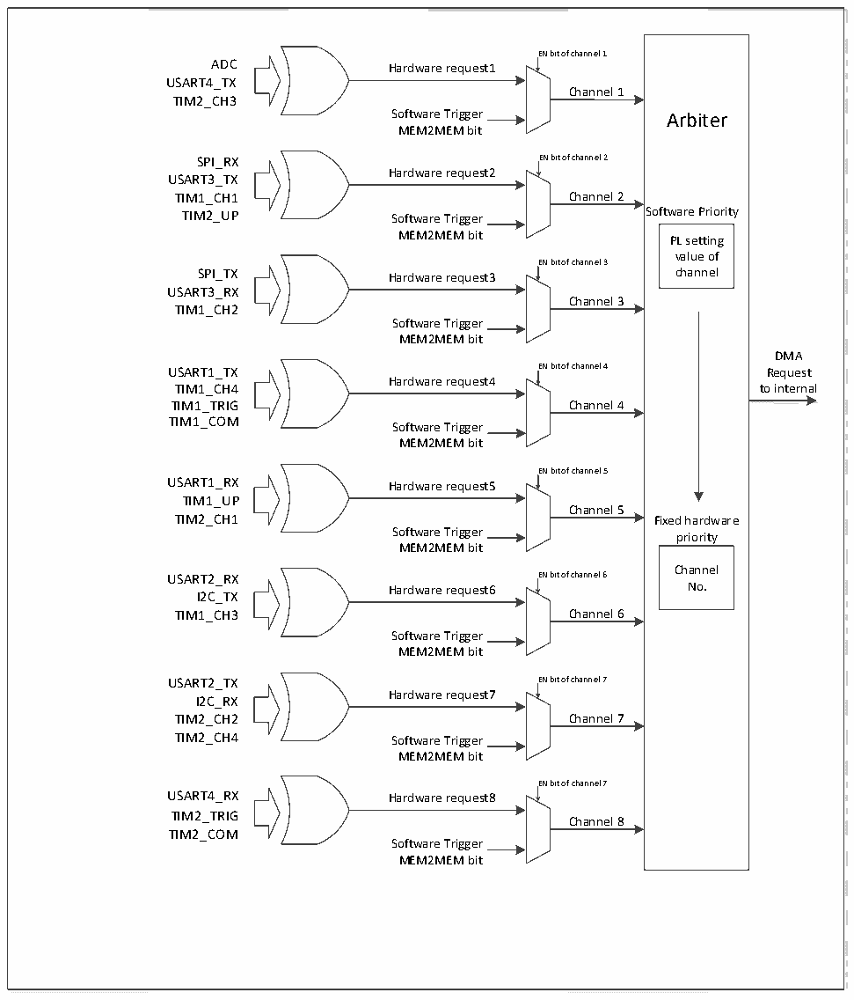

<!-- source-page: 77 -->

[← p.76](0076.md) · [index](../README.md) · [PDF p.77](https://ch32-riscv-ug.github.io/CH32X035/datasheet_zh/CH32X035RM.PDF#page=77) · [p.78 →](0078.md)

<!-- header: CH32X035系列应用手册 https://wch.cn -->

### 9.2.3 DMA请求映射

图9-1 DMA请求映像  
 <!-- rendered from the PDF; verify at https://ch32-riscv-ug.github.io/CH32X035/datasheet_zh/CH32X035RM.PDF#page=77 -->

🖼 Text parsed from the figure above

<!-- image: p77-draw-image-00017 inside the figure -->
<!-- image: p77-draw-image-00016 inside the figure -->
EN bit of channel 1  
<!-- image: p77-draw-image-00018 inside the figure -->
<!-- image: p77-draw-image-00002 inside the figure -->
ADC Hardware request1  
<!-- image: p77-draw-image-00009 inside the figure -->
USART4_TX  
Channel 1  
TIM2_CH3  
<!-- image: p77-draw-image-00019 inside the figure -->
Software Trigger Arbiter  
MEM2MEM bit  
<!-- image: p77-draw-image-00020 inside the figure -->
SPI_RX EN bit of channel 2  
<!-- image: p77-draw-image-00003 inside the figure -->
Hardware request2  
<!-- image: p77-draw-image-00010 inside the figure -->
USART3_TX  
<!-- image: p77-draw-image-00021 inside the figure -->
TIM1_CH1 Channel 2  
TIM2_UP Software Trigger Software Priority  
MEM2MEM bit PL setting  
<!-- image: p77-draw-image-00022 inside the figure -->
value of  
EN bit of channel 3  
<!-- image: p77-draw-image-00004 inside the figure -->
SPI_TX Hardware request3 channel  
<!-- image: p77-draw-image-00011 inside the figure -->
<!-- image: p77-draw-image-00023 inside the figure -->
USART3_RX  
Channel 3  
TIM1_CH2  
Software Trigger  
<!-- image: p77-draw-image-00024 inside the figure -->
MEM2MEM bit  
DMA  
USART1_TX EN bit of channel 4 Request  
<!-- image: p77-draw-image-00025 inside the figure -->
<!-- image: p77-draw-image-00005 inside the figure -->
Hardware request4  
<!-- image: p77-draw-image-00012 inside the figure -->
TIM1_CH4 to internal  
<!-- image: p77-draw-image-00041 inside the figure -->
TIM1_TRIG Channel 4  
<!-- image: p77-draw-image-00026 inside the figure -->
TIM1_COM  
Software Trigger  
MEM2MEM bit  
<!-- image: p77-draw-image-00027 inside the figure -->
EN bit of channel 5  
<!-- image: p77-draw-image-00006 inside the figure -->
USART1_RX Hardware request5  
<!-- image: p77-draw-image-00013 inside the figure -->
TIM1_UP  
Channel 5  
<!-- image: p77-draw-image-00028 inside the figure -->
TIM2_CH1 Fixed hardware  
Software Trigger priority  
MEM2MEM bit  
<!-- image: p77-draw-image-00029 inside the figure -->
Channel  
USART2_RX EN bit of channel 6  
<!-- image: p77-draw-image-00007 inside the figure -->
Hardware request6 No.  
<!-- image: p77-draw-image-00014 inside the figure -->
I2C_TX  
<!-- image: p77-draw-image-00030 inside the figure -->
TIM1_CH3 Channel 6  
Software Trigger  
<!-- image: p77-draw-image-00031 inside the figure -->
MEM2MEM bit  
USART2_TX EN bit of channel 7  
<!-- image: p77-draw-image-00008 inside the figure -->
<!-- image: p77-draw-image-00032 inside the figure -->
Hardware request7  
<!-- image: p77-draw-image-00015 inside the figure -->
I2C_RX  
TIM2_CH2 Channel 7  
<!-- image: p77-draw-image-00033 inside the figure -->
TIM2_CH4 Software Trigger  
MEM2MEM bit  
<!-- image: p77-draw-image-00034 inside the figure -->
EN bit of channel 7  
<!-- image: p77-draw-image-00039 inside the figure -->
USART4_RX Hardware request8  
<!-- image: p77-draw-image-00040 inside the figure -->
TIM2_TRIG  
Channel 8  
<!-- image: p77-draw-image-00035 inside the figure -->
TIM2_COM  
Software Trigger  
MEM2MEM bit  
<!-- image: p77-draw-image-00036 inside the figure -->
<!-- image: p77-draw-image-00037 inside the figure -->
<!-- image: p77-draw-image-00038 inside the figure -->

# DMA 控制器提供 8 个通道，每个通道对应多个外设请求，通过设置相应外设寄存器中对应 DMA

控制位，可以独立的开启或关闭各个外设的DMA功能，具体对应关系如下。  

<!-- p77-table-001 (table-9-1@1) pages 77-78 -->
<table><tr><th>外设</th><th>通道1</th><th>通道2</th><th>通道3</th><th>通道4</th><th>通道5</th><th>通道6</th><th>通道7</th><th>通道8</th></tr><tr><td>ADC</td><td>ADC</td><td></td><td></td><td></td><td></td><td></td><td></td><td></td></tr><tr><td>SPI</td><td></td><td>SPI_RX</td><td>SPI_TX</td><td></td><td></td><td></td><td></td><td></td></tr><tr><td>USART1</td><td></td><td></td><td></td><td>USART1_TX</td><td>USART1_RX</td><td></td><td></td><td></td></tr><tr><td>USART2</td><td></td><td></td><td></td><td></td><td></td><td>USART2_RX</td><td>USART2_TX</td><td></td></tr><tr><td>USART3</td><td></td><td>USART3_TX</td><td>USART3_RX</td><td></td><td></td><td></td><td></td><td></td></tr><tr><td>USART4</td><td>USART4_TX</td><td></td><td></td><td></td><td></td><td></td><td></td><td>USART4_RX</td></tr><tr><td>I2C</td><td></td><td></td><td></td><td></td><td></td><td>I2C_TX</td><td>I2C_RX</td><td></td></tr><tr><td>TIM1</td><td></td><td>TIM1_CH1</td><td>TIM1_CH2</td><td style="text-align:left">TIM1_CH4TIM1_TRIGTIM1_COM</td><td>TIM1_UP</td><td>TIM1_CH3</td><td></td><td></td></tr><tr><td>TIM2</td><td>TIM2_CH3</td><td>TIM2_UP</td><td></td><td></td><td>TIM2_CH1</td><td></td><td style="text-align:left">TIM2_CH2TIM2_CH4</td><td style="text-align:left">TIM2_TRIGTIM2_COM</td></tr></table>

<!-- image: p77-draw-image-00001 bbox=[507.84, 786.12, 527.28, 796.68] -->
<!-- footer: V1.9 77 -->
