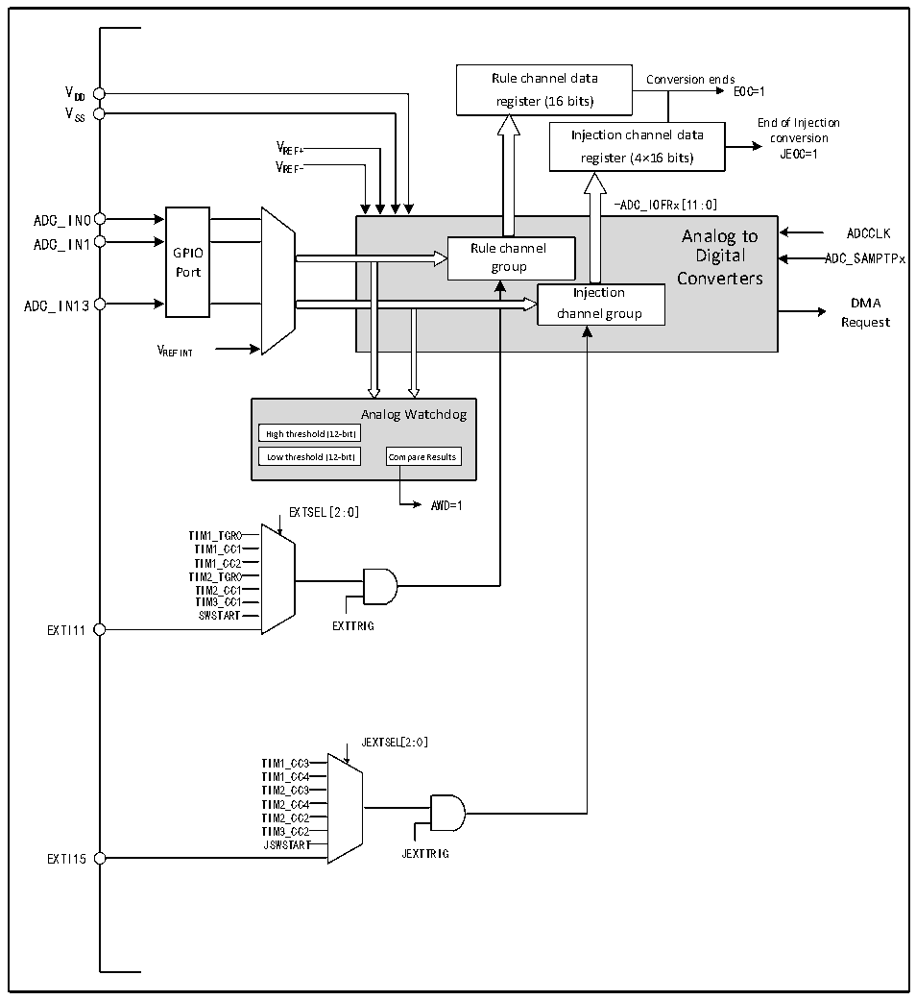

<!-- source-page: 84 -->

[← p.83](0083.md) · [index](../README.md) · [PDF p.84](https://ch32-riscv-ug.github.io/CH32X035/datasheet_zh/CH32X035RM.PDF#page=84) · [p.85 →](0085.md)

<!-- header: CH32X035系列应用手册 https://wch.cn -->

## 10.2 功能描述

### 10.2.1 模块结构

图10-1 ADC模块框图  
 <!-- rendered from the PDF; verify at https://ch32-riscv-ug.github.io/CH32X035/datasheet_zh/CH32X035RM.PDF#page=84 -->

🖼 Text parsed from the figure above

Rule channel data Conversion ends  
V EOC=1  
DD register (16 bits)  
V  
SS End of Injection  
V Injection channel data conversion  
REF+ register (4×16 bits) JEOC=1  
VREF-  
-ADC_IOFRx[11:0]  
GPIOPort  
-ADC_IOFRx[11:0] Analog to Rule channel Digital group Converters Injection channel group  
ADC_IN0  
Analog to ADCCLK  
ADC_IN13 DMA  
Request  
VREFINT  
Analog Watchdog  
High threshold (12-bit)  Low threshold (12-bit)  
AWD=1  
EXTSEL[2:0]  
TIM1_TGR0  
TIM1_CC1  
TIM1_CC2  
TIM2_TGR0  
TIM2_CC1  
TIM3_CC1  
SWSTART  
EXTI11 EXTTRIG  
JEXTSEL[2:0]  
TIM1_CC3  
TIM1_CC4  
TIM2_CC3  
TIM2_CC4  
TIM2_CC2  
TIM3_CC2  
JSWSTART  
EXTI15 JEXTTRIG  

### 10.2.2 ADC配置

1）模块上电  
ADC_CTLR2寄存器的ADON位为1表示ADC模块上电。当ADC模块从断电模式（ADON=0）下进入  
上电状态（ADON=1）后，需要延迟一段时间tSTAB 用于模块稳定时间。之后再次写入ADON位为1，用  
于作为软件启动ADC转换的启动信号。通过清除ADON位为0，可以终止当前转换并将ADC模块置于  
断电模式，这个状态下，ADC几乎不耗电。  
2）采样时钟  
模块的寄存器操作基于HCLK（HB总线）时钟，其转换单元的时钟基准ADCCLK与HCLK同步，由  
<!-- image: p84-draw-image-00001 bbox=[507.84, 786.12, 527.28, 796.68] -->
<!-- footer: V1.9 84 -->
