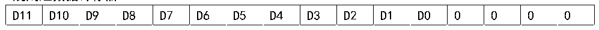
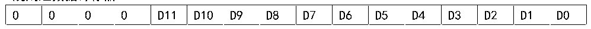

<!-- source-page: 85 -->

[← p.84](0084.md) · [index](../README.md) · [PDF p.85](https://ch32-riscv-ug.github.io/CH32X035/datasheet_zh/CH32X035RM.PDF#page=85) · [p.86 →](0086.md)

<!-- header: CH32X035系列应用手册 https://wch.cn -->
ADC_CTLR3寄存器的CLK_DIV[8:0]域配置分频。  
3）通道配置  
ADC模块提供了14个通道采样源。它们可以配置到两种转换组中：规则组和注入组。以实现任  
意多个通道上以任意顺序进行一系列转换构成的组转换。  
转换组：  
● 规则组：由多达16个转换组成。规则通道和它们的转换顺序在ADC_RSQRx寄存器中设置。  
规则组中转换的总数量应写入ADC_RSQR1寄存器的L[3:0]中。  
● 注入组：由多达4个转换组成。注入通道和它们的转换顺序在ADC_ISQR寄存器中设置。注  
入组里的转换总数量应写入ADC_ISQR寄存器的JL[1:0]中。  
注：如果ADC_RSQRx或ADC_ISQR寄存器在转换期间被更改，当前的转换被终止，一个新的启动信号  
将发送到ADC以转换新选择的组。  
1个内部通道：  
● VREFINT 内部参考电压：连接ADC_IN15通道。  
4）可编程采样时间  
ADC使用若干个ADCCLK周期对输入电压采样，通道的采样周期数目可以通过ADC_SAMPTR1和  
ADC_SAMPTR2寄存器中的SMPx[2:0]位更改。每个通道可以分别使用不同的时间采样。  
总转换时间如下计算：  
TCONV= 采样时间 + 13TADCCLK  
ADC的规则通道转换支持DMA功能。规则通道转换的值储存在一个仅有的数据寄存器ADC_RDATAR  
中，为防止连续转换多个规则通道时，没有及时取走 ADC_RDATAR 寄存器中的数据，可以开启 ADC  
的 DMA 功能。硬件会在规则通道的转换结束时（EOC 置位）产生 DMA 请求，并将转换的数据从  
ADC_RDATAR寄存器传输到用户指定的目的地址。  
对DMA控制器模块的通道配置完成后，写ADC_CTLR2寄存器的DMA位置1，开启ADC的DMA功  
能。  
注：注入组转换不支持DMA功能。  
5）数据对齐  
ADC_CTLR2寄存器中的ALIGN位选择ADC转换后的数据存储对齐方式。12位数据支持左对齐和  
右对齐模式。  
规则组通道的数据寄存器ADC_RDATAR保存的是实际转换的12位数字值；而注入组通道的数据  
寄存器ADC_IDATARx是实际转换的数据减去ADC_IOFRx寄存器的定义的偏移量后写入的值，会存在  
正负情况，所以有符号位（SIGNB）。  
注：数据左对齐仅适用于使用规则组的情况。  

图10-2 数据左对齐  
 <!-- rendered from the PDF; verify at https://ch32-riscv-ug.github.io/CH32X035/datasheet_zh/CH32X035RM.PDF#page=85 -->

规则组数据寄存器  

🖼 Text parsed from the figure above

D11  D10  D9  D8  D7  D6  D5  D4  D3  D2  D1  D0  0  0  0  0  

图10-3 数据右对齐  
 <!-- rendered from the PDF; verify at https://ch32-riscv-ug.github.io/CH32X035/datasheet_zh/CH32X035RM.PDF#page=85 -->

规则组数据寄存器  

🖼 Text parsed from the figure above

0  0  0  0  D11  D10  D9  D8  D7  D6  D5  D4  D3  D2  D1  D0  

注入组数据寄存器  

<!-- p85-table-003 (table-9-2@1) -->
<table><tr><th>SIGNB</th><th>SIGNB</th><th>SIGNB</th><th>SIGNB</th><th>D11</th><th>D10</th><th>D9</th><th>D8</th><th>D7</th><th>D6</th><th>D5</th><th>D4</th><th>D3</th><th>D2</th><th>D1</th><th>D0</th></tr></table>

<!-- image: p85-draw-image-00001 bbox=[507.84, 786.12, 527.28, 796.68] -->
<!-- footer: V1.9 85 -->
