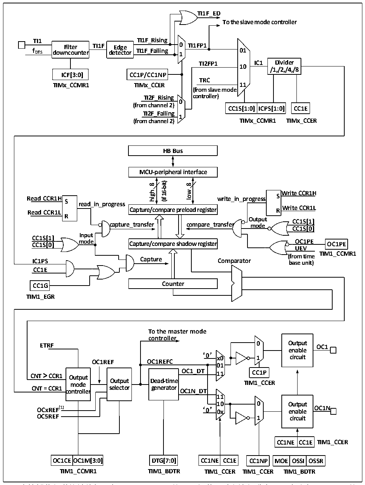

<!-- source-page: 109 -->

[← p.108](0108.md) · [index](../README.md) · [PDF p.109](https://ch32-riscv-ug.github.io/CH32X035/datasheet_zh/CH32X035RM.PDF#page=109) · [p.110 →](0110.md)

<!-- header: CH32X035系列应用手册 https://wch.cn -->

图12-3 比较捕获通道的结构框图  
 <!-- rendered from the PDF; verify at https://ch32-riscv-ug.github.io/CH32X035/datasheet_zh/CH32X035RM.PDF#page=109 -->

🖼 Text parsed from the figure above

<strong>TI1F_ED</strong>  
<strong>To the slave mode controller</strong>  
<strong>TI1 TI1F_Rising</strong>  
<strong>Filter TI1F Edge 0 TI1FP1</strong>  
<strong>f DTS downcounter detector TI1F_Falling 1 01</strong>  
<strong>TI2FP1 IC1 Divider</strong>  
<strong>10</strong>  
<strong>/1,/2,/4,/8</strong>  
<strong>ICF[3:0] CC1P/CC1NP</strong>  
<strong>TRC</strong>  
<strong>TIMx_CCMR1 TIMx_CCER 11</strong>  
<strong>(from slave mode</strong>  
<strong>TI2F_Rising controller)</strong>  
<strong>0</strong>  
<strong>(from channel 2)</strong>  
<strong>CC1S[1:0] ICPS[1:0] CC1E</strong>  
<strong>TI2F_Falling</strong>  
<strong>1</strong>  
<strong>(from channel 2) TIMx_CCMR1 TIMx_CCER</strong>  
<strong>HB Bus</strong>  
<strong>MCU-peripheral interface</strong>  
<strong>16-bit)</strong>  
<strong>8</strong>  
<strong>8</strong>  
<strong>wol Write CCR1H</strong>  
<strong>high</strong>  
<strong>Read CCR1H write_in_progress S S</strong>  
<strong>(if</strong>  
<strong>read_in_progress</strong>  
<strong>Write CCR1L Read CCR1L R</strong>  
<strong>Capture/compare preload register</strong>  
<strong>R</strong>  
<strong>Output CC1S[1]</strong>  
<strong>capture_transfer compare_transfer mode</strong>  
<strong>CC1S[0]</strong>  
<strong>Input</strong>  
<strong>CC1S[1]</strong>  
<strong>mode OC1PE CC1S[0] OC1PE</strong>  
<strong>Capture/compare shadow register</strong>  
<strong>UEV</strong>  
<strong>TIM1_CCMR1</strong>  
<strong>(from time</strong>  
<strong>IC1PS Capture Comparator base unit)</strong>  
<strong>CC1E</strong>  
<strong>CC1G Counter</strong>  
<strong>TIM1_EGR</strong>  
<strong>To the master mode</strong>  
<strong>controller</strong>  
<strong>ETRF 0 Output OC1</strong>  
<strong>enable</strong>  
‘0’  
<strong>x0 1 circuit</strong>  
<strong>OC1REF OC1REFC</strong>  
<strong>01</strong>  
D  Dead-time generator  
<strong>CNT = CCR1 selector generator</strong>  
<strong>controller OC1N_DT</strong>  
<strong>11</strong>  
<strong>10 0 Output</strong>  
<strong>OCxREF(1) ‘0’ 0x enable OC1N</strong>  
<strong>OC5REF 1 circuit</strong>  
CC1NE  CC1E  
OC1CE  OC1M[3:0]  
CC1NE  CC1E  
MOE  OSSI  OSSR  
<strong>OC1CEOC1M[3:0] DTG[7:0] CC1NE CC1E CC1NP MOE OSSI OSSR</strong>  
<strong>TIM1_CCMR1 TIM1_BDTR TIM1_CCER TIM1_CCER TIM1_BDTR</strong>  

比较捕获通道的结构框图如图12-3所示。信号从通道x引脚输入进来后可选做为TIx（TI1的  
来源可以不只是 CH1，见定时器的结构框图 12-1），以 TI1举例：TI1 经过滤波器（ICF[3:0]）生  
成TI1F，再经过边沿检测器分成TI1F_Rising和TI1F_Falling，这两个信号经过选择（CC1P）生成  
TI1FP1，TI1FP1和来自通道2的TI2FP1一起送给CC1S选择成为IC1，经过ICPS分频后送给比较捕  
获寄存器。  
比较捕获寄存器由一个预装载寄存器和一个影子寄存器组成，读写过程仅操作预装载寄存器。  
<!-- image: p109-draw-image-00001 bbox=[507.84, 786.12, 527.28, 796.68] -->
<!-- footer: V1.9 109 -->
