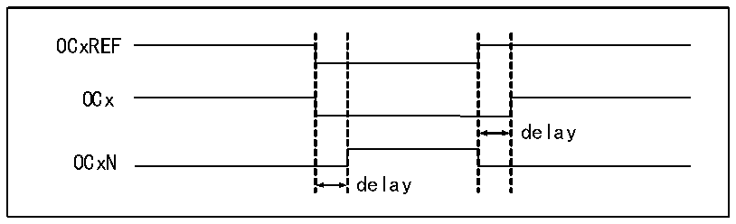

<!-- source-page: 113 -->

[← p.112](0112.md) · [index](../README.md) · [PDF p.113](https://ch32-riscv-ug.github.io/CH32X035/datasheet_zh/CH32X035RM.PDF#page=113) · [p.114 →](0114.md)

<!-- header: CH32X035系列应用手册 https://wch.cn -->
预装载寄存器的值才能被送到影子寄存器，所以在核心计数器开始计数之前，需要置UG位来初始化  
所有寄存器。在PWM模式下，核心计数器和比较捕获寄存器一直在进行比较，根据CMS位，定时器  
能够输出边沿对齐或中央对齐的PWM信号。  
● 边沿对齐  
使用边沿对齐时，核心计数器增计数或减计数，在PWM模式1的情景下，在核心计数器的值大  
于比较捕获寄存器时，OCxREF为高；当核心计数器的值小于比较捕获寄存器时（比如核心计数器增  
长到R16_TIMx_ATRLR的值而恢复成全0时），OCxREF为低。  
● 中央对齐  
使用中央对齐模式时，核心计数器运行在增计数和减计数交替进行的模式下，OCxREF在核心计  
数器和比较捕获寄存器的值一致时进行上升和下降的跳变。但比较标志在三种中央对齐模式下，置  
位的时机有所不同。在使用中央对齐模式时，最好在启动核心计数器之前产生一个软件更新标志（置  
UG位）。  

### 12.3.7 互补输出和死区

比较捕获通道一般有两个输出引脚（比较捕获通道4只有一个输出引脚），能输出两个互补的  
信号（OCx和OCxN），OCx和OCxN可以通过CCxP和CCxNP位独立地设置极性，通过CCxE和CCxNE  
独立地设置输出使能，通过MOE、OIS、OISN、OSSI、OSSR位进行死区和其他的控制。同时使能OCx  
和OCxN输出将插入死区，每个通道都有一个10位的死区发生器。如果存在刹车电路则还要设置MOE  
位。OCx和OCxN由OCxREF关联产生，如果OCx和OCxN都是高有效，那么OCx与OCxREF相同，只  
是OCx的上升沿相当于OCxREF有一个延迟，OCxN与OCxREF相反，它的上升沿相对参考信号的下降  
沿会有一个延迟，如果延迟大于有效输出宽度，则不会产生相应的脉冲。  
如图12-4展示了OCx和OCxN与OCxREF的关系，并展示出死区。  

图12-4 互补输出和死区  
 <!-- rendered from the PDF; verify at https://ch32-riscv-ug.github.io/CH32X035/datasheet_zh/CH32X035RM.PDF#page=113 -->

🖼 Text parsed from the figure above

OCxREF  
OCx  
delay  
OCxN  
delay  

### 12.3.8 刹车信号

当产生刹车信号时，输出使能信号和无效电平都会根据MOE、OIS、OISN、OSSI和OSSR等位进  
行修改。但OCx和OCxN不会在任何时间都处在有效电平。刹车事件源可以来自于刹车输入引脚，也  
可以是一个时钟失败事件，而时钟失败事件由CSS（时钟安全系统）产生。  
在系统复位后，刹车功能被默认禁止（MOE 位为低），置 BKE 位可以使能刹车功能，输入的刹  
车信号的极性可以通过设置 BKP 设置，BKE 和 BKP信号可以被同时写入，在真正写入之前会有一个  
HB时钟的延迟，因此需要等一个HB周期才能正确读出写入值。  
在刹车引脚出现选定的电平系统将产生如下动作：  
1） MOE位被异步清零，根据OSSI位的设置将输出置为无效状态、空闲状态或复位状态；  
2） 在MOE被清零后，每一个输出通道输出由OSIx确定的电平；  
3） 当使用互补输出时：输出被置于无效状态，具体取决于极性；  
4） 如果BIE被置位，当BIF置位，会产生一个中断；如果设置了BDE位，则会产生一个DMA  
请求；  
5） 如果AOE被置位，在下一个更新事件UEV时，MOE位被自动置位。  
<!-- image: p113-draw-image-00001 bbox=[507.84, 786.12, 527.28, 796.68] -->
<!-- footer: V1.9 113 -->
